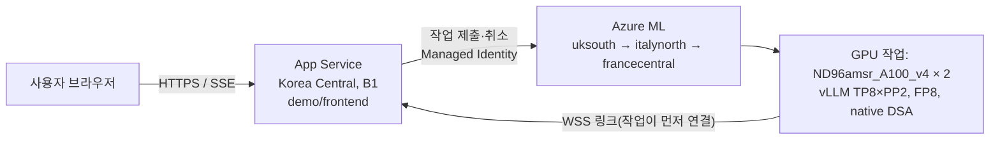

# A.X K2 데모 운영 가이드

A100 80GB 16장(Standard_ND96amsr_A100_v4 × 2노드, Azure ML)에서 도는 A.X K2를 고객에게 보여 주는 데모입니다.



- 프런트엔드(App Service)는 항상 켜져 있고, 비밀번호로 보호됩니다. 채팅 내용은 어디에도 저장하지 않습니다.
- GPU는 관리자가 켤 때만 돕니다. 켜면 지역 3곳에 동시에 저우선(low priority) 작업을 내고, 먼저 2노드를 모두 받은 곳을 남기고 나머지는 취소합니다.
- GPU 작업은 바깥에서 들어오는 포트가 없습니다. 작업 안의 `backend_link.py`가 App Service로 WebSocket을 열고, 채팅 요청은 이 링크를 타고 vLLM으로 갑니다.
- 저우선 노드는 회수(preemption)될 수 있습니다. 그러면 슈퍼바이저가 같은 지역에 다시 내고, 안 되면 다시 3곳 경주를 합니다. 화면에는 "준비 중"으로 보입니다.
- GPU 작업은 실행 스크립트(`aml/src`)를 작업 명령에 넣지 않고, 시작할 때 프런트엔드의 `/api/link/src`에서 내려받아 SHA-256을 확인합니다. Azure ML은 작업의 docker 인자(환경 변수+명령) 길이를 제한해서, 스크립트를 base64로 넣으면 시작 3분 만에 `ArgumentTooLong`으로 실패합니다.
- 켜고 나서 채팅이 되기까지 실측 약 25분입니다(노드 확보·InfiniBand 확인 → 가중치 676 GB 다운로드 약 18분 → 로드 약 5분). 노드를 기다리는 시간은 그때 용량에 따라 더 걸릴 수 있습니다.

## 처음 배포

WSL(Ubuntu)에서, `az login`이 된 상태로 실행합니다. 로컬 pip 설치는 필요 없습니다(패키지는 App Service가 서버에서 설치).

```bash
AXK2_SUB=<구독 ID> bash demo/deploy.sh
```

- 없는 리소스만 만들고 코드를 다시 올립니다. 몇 번 실행해도 됩니다.
- 처음 실행할 때만 데모·관리자 비밀번호를 만들어 한 번 출력하고, `~/.axk2-demo/passwords`(권한 0600)에 보관합니다. 다시 실행해도 비밀번호는 바뀌지 않습니다.
- GPU 클러스터와 작업 영역은 `aml/setup_region.sh`로 미리 만들어 둡니다.
- 배포 중 게이트웨이 504가 보여도 Kudu 빌드는 계속됩니다. 스크립트가 `/healthz` 200을 확인할 때까지 기다립니다.

## 일상 운영 (`demo/ctl.sh`)

| 명령 | 하는 일 |
|---|---|
| `demo/ctl.sh status` | 전원 상태, 현재 작업·지역, 링크, 대기열, 평가 진행 상황 |
| `demo/ctl.sh on` | GPU 켜기 (과금 시작, 준비까지 실측 약 25분, 노드 대기에 따라 더 걸림) |
| `demo/ctl.sh off` | GPU 끄기 (작업 취소, 과금 중지) |
| `demo/ctl.sh restart` | 지금 GPU 작업을 새 작업으로 교체 |
| `demo/ctl.sh eval start aime,kobalt 4 0` | 벤치마크 평가 시작 (suite, 반복 횟수, 문항 제한) |
| `demo/ctl.sh eval stop` | 평가 중지 (이미 받은 결과는 남음) |
| `demo/ctl.sh password demo` | 데모 비밀번호 교체 (기존 데모 세션은 로그아웃) |

평가와 채팅은 같은 클러스터를 씁니다. 평가 요청은 vLLM 우선순위가 낮아(채팅 0, 평가 10) 채팅이 먼저 들어가지만, 한 번 들어간 요청은 매 스케줄 단계를 함께 나눠 씁니다.

- 일반 평가(AIME·KoBALT·CLIcK·IFBench) 중에는 채팅이 됩니다. 실측으로 세 문장 답변이 약 8초 걸렸습니다(평소 첫 토큰 0.7초).
- NIAH(최대 25만 토큰 문맥)를 돌리는 동안에는 단계 하나가 수 초로 늘어 채팅이 사실상 멈춥니다. 그래서 NIAH는 항상 다른 suite 뒤에 돌고, **고객 시연 중에는 NIAH 평가를 돌리지 마세요.**

관리자 비밀번호는 `AXK2_ADMIN_PASSWORD` 환경 변수, `~/.axk2-demo/passwords`, 입력 프롬프트 순서로 찾습니다. 같은 기능을 브라우저의 `/admin` 페이지에서도 쓸 수 있습니다.

## 비용

- GPU: 노드·시간당 약 $8.19(uksouth 저우선) × 2노드 ≈ 시간당 $16. 같은 2노드를 온디맨드로 쓰면 시간당 약 $82입니다.
- 프런트엔드: App Service B1 한 대 (항상 켜짐, 월 수십 달러 수준).
- 관리자 페이지에 지역별 GPU 사용 시간과 추정 비용이 나옵니다. **데모가 끝나면 반드시 `ctl.sh off`** 로 끄세요.

## 고객에게 전달할 것

- 주소 `https://<앱 이름>.azurewebsites.net` 와 데모 비밀번호(메일과 다른 경로로 전달 권장).
- 데모 비밀번호는 언제든 `ctl.sh password demo`로 바꿔 접근을 끊을 수 있습니다.
- 관리자 비밀번호는 고객에게 주지 않습니다.

## 문제 해결

| 증상 | 확인할 것 |
|---|---|
| 채팅이 "GPU 클러스터가 아직 준비되지 않았습니다" | `ctl.sh status`에서 전원이 on인지, 작업이 Running인지, 링크가 연결됐는지 |
| 켰는데 오래 준비 중 | 저우선 용량 부족일 수 있음. 슈퍼바이저가 지역을 돌며 다시 냅니다. 이벤트 로그 확인 |
| 채팅이 "입력을 읽는 중…"에서 몇 분씩 멈춤 | NIAH 평가가 도는 중인지 `ctl.sh status`의 평가 상태 확인. 시연 중이면 `ctl.sh eval stop` |
| 작업이 시작 몇 분 만에 실패하고 로그가 없음 | RunHistory `/details` API의 오류 확인(`ArgumentTooLong`이면 작업 명령·환경 변수가 너무 김) |
| 사이트가 안 열림 | `az webapp log tail -g <RG> -n <앱 이름>` |
| 비밀번호 분실 | 관리자 비밀번호로 `ctl.sh password demo`. 관리자 비밀번호까지 잃었으면 App Service 설정 `AXK2_ADMIN_PASSWORD_HASH`를 지우고 `deploy.sh`를 다시 실행 |
