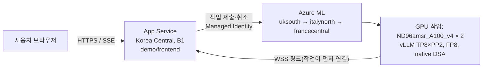

# A.X K2 데모 운영 가이드

A100 80GB 16장(Standard_ND96amsr_A100_v4 × 2노드, Azure ML)에서 도는 A.X K2를 고객에게 보여 주는 데모입니다.



- 프런트엔드(App Service)는 항상 켜져 있습니다. 대화·파일은 임시 메모리에만 있으며 디스크에 저장하지 않습니다.
- 화면은 ChatGPT 스타일 채팅 하나뿐입니다(추론 과정·도구 호출 카드 표시). 클러스터·벤치마크 결과는 웹에 두지 않고 `docs/report`에만 둡니다.
- 기본은 **공개 데모 모드**(`AXK2_OPEN_DEMO=1`)입니다. 로그인 없이 주소만 알면 채팅할 수 있습니다(내부 데모용). 비밀번호로 막으려면 `AXK2_OPEN_DEMO=0`으로 `deploy.sh`를 다시 실행하세요. 관리자 페이지(`/admin`)는 어느 모드든 관리자 비밀번호가 필요합니다.
- GPU는 관리자가 켤 때만 돕니다. 켜면 지역 3곳에 동시에 저우선(low priority) 작업을 내고, 먼저 2노드를 모두 받은 곳을 남기고 나머지는 취소합니다.
- GPU 작업은 바깥에서 들어오는 포트가 없습니다. 작업 안의 `backend_link.py`가 App Service로 WebSocket을 열고, 채팅 요청은 이 링크를 타고 vLLM으로 갑니다.
- 저우선 노드는 회수(preemption)될 수 있습니다. 그러면 슈퍼바이저가 같은 지역에 다시 내고, 안 되면 다시 3곳 경주를 합니다. 화면에는 "준비 중"으로 보입니다.
- GPU 작업은 실행 스크립트(`aml/src`)를 작업 명령에 넣지 않고, 시작할 때 프런트엔드의 `/api/link/src`에서 내려받아 SHA-256을 확인합니다. Azure ML은 작업의 docker 인자(환경 변수+명령) 길이를 제한해서, 스크립트를 base64로 넣으면 시작 3분 만에 `ArgumentTooLong`으로 실패합니다.
- 켜고 나서 채팅이 되기까지 실측 약 25분입니다(노드 확보·InfiniBand 확인 → 가중치 676 GB 다운로드 약 18분 → 로드 약 5분). 노드를 기다리는 시간은 그때 용량에 따라 더 걸릴 수 있습니다.

## 처음 배포

WSL(Ubuntu)에서, `az login`이 된 상태로 실행합니다. 로컬 pip 설치는 필요 없습니다(패키지는 App Service가 서버에서 설치).

```bash
AXK2_SUB=<구독 ID> bash demo/deploy.sh
```

- 없는 리소스만 만들고 코드를 다시 올립니다. 몇 번 실행해도 됩니다.
- 처음 실행할 때만 데모·관리자 비밀번호를 만들어 한 번 출력하고, `~/.axk2-demo/passwords`(권한 0600)에 보관합니다. 다시 실행해도 비밀번호는 바뀌지 않습니다.
- GPU 클러스터와 작업 영역은 `aml/setup_region.sh`로 미리 만들어 둡니다.
- 배포 중 게이트웨이 504가 보여도 Kudu 빌드는 계속됩니다. 스크립트가 `/healthz` 200을 확인할 때까지 기다립니다.

## 일상 운영 (`demo/ctl.sh`)

| 명령 | 하는 일 |
|---|---|
| `demo/ctl.sh status` | 전원 상태, 현재 작업·지역, 링크, 대기열, 평가 진행 상황 |
| `demo/ctl.sh on` | GPU 켜기 (과금 시작, 준비까지 실측 약 25분, 노드 대기에 따라 더 걸림) |
| `demo/ctl.sh off` | GPU 끄기 (작업 취소, 과금 중지) |
| `demo/ctl.sh restart` | 지금 GPU 작업을 새 작업으로 교체 |
| `demo/ctl.sh eval start aime,kobalt 4 0` | 벤치마크 평가 시작 (suite, 반복 횟수, suite별 무작위 표본 문항 수. 0이면 전체) |
| `demo/ctl.sh eval stop` | 평가 중지 (이미 받은 결과는 남음) |
| `demo/ctl.sh password demo` | 데모 비밀번호 교체 (기존 데모 세션은 로그아웃) |

평가와 채팅은 같은 클러스터를 씁니다. 평가 요청은 vLLM 우선순위가 낮아(채팅 0, 평가 10) 채팅이 먼저 들어가지만, 한 번 들어간 요청은 매 스케줄 단계를 함께 나눠 씁니다.

- 일반 평가(AIME·KoBALT·CLIcK·IFBench) 중에는 채팅이 됩니다. 실측으로 세 문장 답변이 약 8초 걸렸습니다(평소 첫 토큰 0.7초).
- NIAH(최대 25만 토큰 문맥)를 돌리는 동안에는 단계 하나가 수 초로 늘어 채팅이 사실상 멈춥니다. 그래서 NIAH는 항상 다른 suite 뒤에 돌고, **고객 시연 중에는 NIAH 평가를 돌리지 마세요.**

관리자 비밀번호는 `AXK2_ADMIN_PASSWORD` 환경 변수, `~/.axk2-demo/passwords`, 입력 프롬프트 순서로 찾습니다. 같은 기능을 브라우저의 `/admin` 페이지에서도 쓸 수 있습니다.

## 비용

- GPU: 노드·시간당 약 $8.19(uksouth 저우선) × 2노드 ≈ 시간당 $16. 같은 2노드를 온디맨드로 쓰면 시간당 약 $82입니다.
- 프런트엔드: App Service B1 한 대 (항상 켜짐, 월 수십 달러 수준).
- 관리자 페이지에 지역별 GPU 사용 시간과 추정 비용이 나옵니다. **사용자가 명시적으로 요청할 때만 GPU를 끕니다.** 시연 종료나 프런트엔드 재배포를 이유로 끄거나 재시작하지 않습니다.

## 고객에게 전달할 것

- 주소 `https://<앱 이름>.azurewebsites.net` (공개 데모 모드에서는 주소만 있으면 됩니다).
- 비밀번호 모드(`AXK2_OPEN_DEMO=0`)라면 데모 비밀번호도 함께(메일과 다른 경로로 전달 권장). `ctl.sh password demo`로 언제든 바꿔 접근을 끊을 수 있습니다.
- 공개 모드에서 접근을 끊으려면 `ctl.sh off`(GPU 끄기) 또는 `AXK2_OPEN_DEMO=0`으로 재배포하세요.
- 관리자 비밀번호는 고객에게 주지 않습니다.

## Microsoft Agent Framework 도구 데모

`agent-framework-core==1.20.0`의 실제 `Agent`, `FunctionInvocationLayer`, 스트리밍,
`FunctionMiddleware`를 사용합니다. `agent.py`의 `AXClient`는 기존 역방향 WebSocket으로만
vLLM에 요청하며 `reasoning_content`와 도구 호출/결과를 다음 모델 호출에 재전달합니다.
모델 판단·코드 생성·최종 답변은 기존 SKT A.X K2(FP8 native DSA, TP8×PP2)만 수행합니다.
OpenAI/Azure OpenAI/Foundry 추론, 대체 LLM, Azure AI Search는 사용하지 않습니다.
브라우저는 서버가 보낸 실제 추론과 도구 상태만 표시하며 실행 루프를 소유하지 않습니다.
MAF의 `options.instructions`를 실제 vLLM system 메시지로 전달합니다. 도구 안내와
현재 workspace 파일 목록이 모델에 누락되지 않도록 서버에서 매 턴 구성합니다.
동일 탭의 capability 토큰 안에서만 원본 reasoning·함수 호출 ID·실제 결과를 RAM에 보관합니다
(최대 160메시지/2 MiB, 실제 도구 결과 목록 48개/512 KiB). 오래된 전체 턴을 제외하면 안내하며
장기 기억·벡터 DB·영구 대화 저장은 없습니다. 새 채팅은 실행을 취소하고 이전 파일/토큰/대화를 폐기합니다.
도구 토글과 직접 입력한 명확한 도구·웹검색 금지를 서버 등록/실행 경계에서 적용합니다.
허용된 명시적 실행 요청에는 해당 함수 호출을 요청하고, 호출 없이 대기만 약속하면 A.X에 한 번만
실제 실행 또는 구체적 제한 설명을 재요청합니다. 그래도 필요한 호출이 없으면 미실행 오류입니다.
상태 카드는 실제 middleware 이벤트이며 턴 종료 뒤 백그라운드 작업은 없습니다.

데스크톱 화면의 채팅과 입력창은 동일한 1200px 상한과 좌우 gutter를 사용합니다.
시작 화면은 코드·계산·문서/데이터·미리보기와 Web IQ 웹/뉴스/주가/장소의 샘플 8개를 제공합니다.
샘플 클릭은 도구를 자동 활성화하며, 1200px 이상에서는 4열×2행, 좁은 데스크톱에서는 2열×4행입니다.
본문 18px, 주요 전송·첨부·토글 컨트롤 42px이며 좁은 패널에서는 함께 줄어듭니다.
대화와 입력 영역 모두 동일한 stable scrollbar gutter를 예약하여 긴 대화에서도 정렬을 유지합니다.
CSS zoom/transform 확대나 상시 IDE 패널은 사용하지 않습니다.

지원 도구: 유리수 기반 정확 계산, IANA 시간대, 파일 목록/읽기/문자열 검색/텍스트 수정/
unified diff/다운로드, PDF 텍스트(page)/DOCX(paragraph)/TXT·MD(line) 참조,
CSV·XLSX 첫 시트의 profile/sum/mean/min/max와 SVG 막대 차트, 정적 HTML 미리보기.
PDF는 새 첨부를 실제 `read_pdf`로 확인한 후 답변합니다.
허용된 새 PDF는 서버가 확인한 정확한 경로로 실제 MAF 함수/middleware를
통해 첫 페이지를 먼저 읽고 그 결과를 A.X에 전달합니다. 모델의 계획 문장만으로 판독 완료를
표시하지 않으며 실패·취소는 확인 완료로 기록하지 않습니다. 도구 금지 시 판독하지 않습니다.
후속 페이지는 모델이 실제 도구로 읽어야 하며 첫 페이지 판독은 전체 문서 판독을 뜻하지 않습니다.
파일명·크기·레이아웃만으로
스캔 문서라고 추정하지 않습니다. 최대 100페이지, 호출당 1~5페이지(기본 3),
페이지당 10000자 chunk와 `next_page`/`next_offset`을 제공합니다.
Korean text layer도 읽으며 페이지 citation을 반환합니다. 암호화·손상·범위·자원 제한,
텍스트 없음, 실제 이미지 객체가 있지만 텍스트가 없는 경우를 별도 typed 결과로 표시합니다.
이미지-only 결과는 `ocr_not_configured`입니다. 복잡한 배치의 읽기 순서는 달라질 수 있고
텍스트 추출은 차트의 시각적 해석이 아닙니다. OCR은 미구성이며 외부로 PDF를 전송하지 않습니다.
XLSX 수식은 실행·평가하지 않고 오류로 안내합니다.
가짜 날씨는 등록하지 않습니다. 코드·diff·결과는 접이식 카드 안에 표시되고
실제 `write_file` 저장 성공 시 파일명과 다운로드 버튼은 카드를 펼치지 않아도 보입니다.
`.py`를 포함한 지원 파일은 대화의 권한 토큰으로만 다운로드하며 저장된 bytes와 UTF-8 파일명을
`Content-Disposition: attachment`로 전달합니다. 모델의 임의 링크를 다운로드 경로로 사용하지 않습니다.
차트/HTML은 버튼을 눌러야 열립니다. HTML은 URL 속성·활성 태그를 제거한 뒤
스크립트·폼·네트워크가 차단된 opaque sandbox iframe으로만 표시합니다
(외부 CSS/JS·이미지 및 동적 앱 실행은 지원하지 않음).

첨부는 대화별 무작위 capability 토큰으로 격리합니다. 토큰은 URL/쿠키/로그에 넣지 않습니다.
대화당 8 MiB/100파일, 동시에 16개 대화 workspace, 비활성 30분 후 정리
(재배포 시 소실), ZIP expanded 8 MiB/200 member/압축비 100 이하입니다.
절대 경로·상위 경로·심볼릭 링크·암호화 ZIP·미지원 파일은 거부합니다.
동일 이름 재업로드는 거부하고 모델 수정은 workspace 내부에서만 허용합니다.
추론은 최대 5회, 도구 실행 24회, 턴 15분으로 제한합니다.
취소 시 기존 relay의 cancel을 통해 vLLM 요청을 중단하며 GPU 작업 자체는 계속 실행됩니다.

**Web IQ:** [공식 문서](https://webiq.microsoft.ai/documentation/)는 enterprise limited access를
설명합니다. `web_iq.py`는 공식 `mcp==1.30.0` SDK로 initialize → tools/list → tools/call을
수행합니다. 기존 승인된 사용자 프로젝트의 직접 MCP 계약
(`https://api.microsoft.ai/v3/mcp`, `x-apikey`, `web`, `query`)을 지원하고,
실제 서버가 광고한 도구별 input schema를 검증한 후에만 각각 native MAF 도구로 등록합니다.
Foundry 연결에서 키를 관리하더라도 검색은 MCP에 직접 보내며 Foundry 모델을 호출하지 않습니다.
미구성/연결 실패 시 검색 도구를 등록하지 않으며 `/api/capabilities`와 모델 system 메시지가
실제 상태와 blocker를 전달합니다. MCP 테스트 fixture는 실제 enterprise 검색 검증이 아닙니다.

기존 Web IQ 접근을 연결하려면 운영자가 승인된 키를 **secure App Service setting**
`AXK2_WEBIQ_API_KEY` 또는 승인된 secret reference로 설정하고
`AXK2_WEBIQ_ACCESS_APPROVED=1`로 검색 사용 승인을 표시합니다. 키를 채팅·repo·로그에 넣지 않습니다.
다른 검증된 enterprise 계약은 `AXK2_WEBIQ_ENDPOINT`, `AXK2_WEBIQ_TOOL`,
`AXK2_WEBIQ_QUERY_FIELD`, `AXK2_WEBIQ_ARGUMENTS_JSON`으로 명시합니다.
별도 계약의 bearer auth는 `AXK2_WEBIQ_BEARER_TOKEN`이며 API key와 동시에 설정하지 않습니다.
리디렉션·자동 OAuth/가입·권한 생성은 하지 않습니다. 연결 설정 변경 후 frontend를 다시 시작합니다.

로컬에서 키를 제공할 때는 AX worktree 루트의 git-excluded `.env.webiq`에
`AXK2_WEBIQ_API_KEY`와 `AXK2_WEBIQ_ENDPOINT`만 입력하고 저장 사실을 알려 주세요.
키 값을 채팅에 붙여 넣지 않습니다. 이 파일은 서버가 자동 로드하지 않으며,
운영자가 해당 파일만 읽도록 승인받은 뒤 실제 공개 검색을 검증하고 secure App Service
setting으로 전달합니다. 배포 bundle은 루트 입력 파일을 포함하지 않고 frontend 안의
모든 `.env`-prefixed 파일/디렉터리도 제외합니다.

공개 일반 검색어를 지원하며, 문서 5개 주제 제한은 없습니다.
현재 공급자가 광고하는 `web`, `news`, `finance`, `places`, `autosuggest`, `browse`,
`images`, `videos`, `sports`, `sonic`을 각각 `web_iq_<이름>` MAF 도구로 제공합니다.
`finance`에는 query/language/region만 전달하고, 뉴스·미디어·통합 검색 등에는
해당 도구가 실제 광고한 필드만 전달합니다. `sonic`은 통합 웹·뉴스·금융 검색이며 음성 도구가 아닙니다.
발견됐다는 사실과 실제 자료가 반환됐다는 사실은 구분합니다:
`tools`는 발견된 지원 목록, `verified_tools`는 성공한 실제 호출 목록입니다.
현재 공개 smoke 호출에서 10개 모두 실제 응답을 받았으나 autosuggest 응답에는 제안 목록이 없었습니다.
스포츠 응답에는 경기 자료가 있었지만 citation URL은 없었으며 출처 링크를 만들지 않습니다.

첨부 파일이 없는 대화에서는 자유로운 공개 검색과 후속 검색이 가능합니다.
첨부가 있는 대화에서는 서버가 최신 사용자 메시지로 **턴별 검색 허가**를 만들고
명시적인 검색 요청에 사용자가 직접 입력한 검색어만 허용합니다.
파일명·파일 내용·업로드에서 추출한 새 검색어는 middleware에 묶인 도구 permission이 거부합니다.
이는 비공개 파일을 검색 자료로 보내는 동의가 아닙니다.
같은 대화에서 첨부와 무관한 공개 검색을 하려면 검색어를 직접 입력하세요;
자유롭게 검색어를 확장하려면 파일 없는 새 대화를 사용합니다. 자격증명 형태의 검색어도 거부합니다.
요청 30초, 응답 192 KiB, 표시 citation 최대 12개이며 실제 공급자가 반환한 URL/원본 provenance만
유지합니다. 성공한 실제 query가 있어야 `verified_search`가 true입니다.
실제 schema에서 광고한 경우 기본 검색을 최대 5개 결과,
`contentFormat=passage`, `maxLength=1500`, `safeSearch=strict`로 제한합니다.
passage 미지원 browse는 text를 사용합니다. 상한 초과 입력은 오류로 표시하며 조용히 무시하지 않습니다.
`browse`는 공개 HTTP(S) 도메인만 허용하며 자격증명·query string·인증 URL·사설 DNS 주소를 거부합니다.
공급자 indexed retrieval만 사용(`liveCrawl=none`, dynamic rendering 금지)하여
실시간 크롤링·리디렉션을 통한 내부 URL 접근을 요청하지 않습니다. App Service는 대상 페이지를 fetch하지 않습니다.
입력/결과/시간은 접이식 action 카드, 출처는 해당 카드의 링크로 확인합니다. 대체 검색은 없습니다.
뉴스·주가·장소는 실제 반환 필드를 읽기 쉽게 표시하고 원본 JSON은 별도로 펼칩니다.
이미지·동영상은 원본 출처 링크만 제공하며 자동 로드/임베드/재배포하지 않습니다(CSP 유지).
금융 카드는 공급자의 종목·통화·가격·거래 시각·시간대·자료 출처를 표시하며
거래소나 지연 여부가 응답에 없으면 미제공/미확인입니다. 조회 시각은 시세 기준 시각이 아닙니다.
삼성전자 공개 live smoke는 `005930`, KRW, LSEG, `lastTradedAt`을 실제 반환했지만
거래소·지연 상태는 미제공이므로 실시간 KRX feed라고 보증하지 않습니다.

`run_tests`도 승인된 외부 격리 샌드박스가 없어 명시적 미구성 오류만 반환합니다.
호스트/GPU에서 업로드·모델 생성 코드를 실행하지 않으며 테스트 통과를 꾸미지 않습니다.
실행 서비스를 연결하려면 자원·시간·네트워크·자격증명 격리 계약과 별도 승인이 필요합니다.
새 리소스나 권한은 자동 생성하지 않습니다. 파일 수정·diff·미리보기·다운로드는 이와 독립적으로 동작합니다.

기존 서비스의 설정/identity/권한/GPU를 유지한 코드 전용 배포:

```bash
AXK2_SUB=<구독 ID> AXK2_FRONTEND_ONLY=1 bash demo/deploy.sh
```

배포 뒤 `/healthz`의 `agent: maf-1.20.0`을 확인하고 `/api/agent` 실제 턴을 검증하세요.
건강 응답만으로 모델·도구 실행 성공을 판단하지 않습니다.

## 문제 해결

| 증상 | 확인할 것 |
|---|---|
| 채팅이 "GPU 클러스터가 아직 준비되지 않았습니다" | `ctl.sh status`에서 전원이 on인지, 작업이 Running인지, 링크가 연결됐는지 |
| 켰는데 오래 준비 중 | 저우선 용량 부족일 수 있음. 슈퍼바이저가 지역을 돌며 다시 냅니다. 이벤트 로그 확인 |
| 채팅이 "입력을 읽는 중…"에서 몇 분씩 멈춤 | NIAH 평가가 도는 중인지 `ctl.sh status`의 평가 상태 확인. 시연 중이면 `ctl.sh eval stop` |
| 작업이 시작 몇 분 만에 실패하고 로그가 없음 | RunHistory `/details` API의 오류 확인(`ArgumentTooLong`이면 작업 명령·환경 변수가 너무 김) |
| 사이트가 안 열림 | `az webapp log tail -g <RG> -n <앱 이름>` |
| 비밀번호 분실 | 관리자 비밀번호로 `ctl.sh password demo`. 관리자 비밀번호까지 잃었으면 App Service 설정 `AXK2_ADMIN_PASSWORD_HASH`를 지우고 `deploy.sh`를 다시 실행 |
