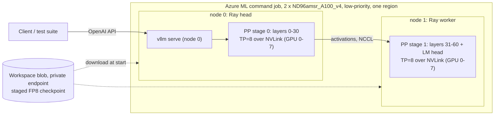

# A.X-K2 serving design: standard multi-node inference on A100

Snapshot: 2026-10-04. This supersedes the "blocked" conclusion in
[the handoff](HANDOFF.md) for the A100 path. Results of each stage are in
section 8 and in `evidence/`.

## 1. Method review: what was wrong before

**GPU cluster tools do not merge GPUs into one large GPU.** Slurm, Ray,
Kubernetes (KubeRay, LeaderWorkerSet, KAITO), CycleCloud and Azure ML only
*allocate nodes and start processes*. A distributed **inference engine**
(vLLM, SGLang, TensorRT-LLM) creates the "one model, one endpoint" experience:
it shards the weights with tensor/pipeline/expert parallelism, moves
activations with NCCL (NVLink inside a node, InfiniBand/Ethernet between
nodes), and serves one OpenAI-compatible API with continuous batching and a
paged KV cache. Rack-scale systems marketed as "one big GPU" still run model
parallelism underneath.

SKT serves A.X-K2 exactly this way. Their fork contains
`k2_dsa_test/scale_ab/serve_k2.sbatch`: Slurm `srun` with a pyxis/enroot
container image running `vllm serve --tensor-parallel-size 8` on one 8xB300
node. They deliberately chose TP over DP+EP because the DP/EP lock-step hung
in long-context evaluation.

The earlier work in this repository (`experiments/axk2_dist_*`) hand-wrote a
block runtime: FP32 dequantised weights, a custom loader, one blocking NCCL
send/receive per block and no batching, paged KV cache or API. It was a
correctness workaround for the missing SM80 sparse-attention kernels, **not a
serving method**, and it is kept only as a numerical oracle.

Best practice, which this design follows:

- One engine process group behind one endpoint. Common multi-node layout:
  **tensor parallel = GPUs per node** (NVLink), **pipeline parallel = number
  of nodes** (vLLM parallelism docs; KAITO multi-node presets; the Azure
  `inference-toolkit` sample serving Qwen3-235B on 2 x 8 A100 with TP8 x PP2).
- Identical container image and model path on every node; Ray (or Slurm, LWS)
  only forms the group.
- **One region and one network fabric.** Pooling quota from several regions
  into one model is not viable: every decode step would cross a WAN once per
  pipeline stage, and an eviction anywhere stops the whole engine. Separate
  regions can host separate *replicas* behind a load balancer, not one model.

## 2. Capacity without a quota increase

| Pool | Limit in this subscription | A100 80GB nodes it allows |
| --- | --- | --- |
| VM quota, A100 families (all regions checked) | 0 vCPU | 0 |
| VM Spot quota | 100 vCPU per region; increase requests throttled (429) | 1 x ND96amsr (96 vCPU) |
| **Azure ML low-priority compute** | **300 vCPU per region, no per-family cap** | **3 x ND96amsr_A100_v4 (24 GPUs)** |

`Standard_ND96amsr_A100_v4` (8 x A100 80GB, NVLink, InfiniBand) is
low-priority capable for Azure ML in swedencentral, westus2, uksouth,
francecentral, italynorth and polandcentral. Two nodes (192 vCPU, 16 GPUs,
1280 GB) hold the ~656 GiB FP8 weights at ~41 GiB per GPU and leave room for
KV cache. SKT's 4-bit NVFP4 checkpoint (371 GiB) fits on one node (8.4).
Azure ML retired low-priority VMs on 2026-03-31; such clusters are
now allocated and billed as **Spot**: preemptible, never above pay-as-you-go,
and the price cannot be capped. The Sweden Spot rate was USD 10.55 per node-hour.
See `evidence/azure-capacity-snapshot.json`.

## 3. Architecture

| Layer | PoC choice | Production equivalent |
| --- | --- | --- |
| Capacity | Azure ML compute cluster, low-priority ND96amsr x 2, min 0 nodes | Same SKU on demand/reserved in the customer subscription |
| Orchestration | One AML command job, `distribution: pytorch`, 1 process per node; script starts the Ray head/worker | AKS + KubeRay or LeaderWorkerSet (KAITO), or CycleCloud Slurm |
| Engine | vLLM 0.23.0 + SKT fork + TRITON_MLA_SPARSE port (section 5b), `--tensor-parallel-size 8 --pipeline-parallel-size 2 --distributed-executor-backend ray` | Same command and image |
| Kernels on SM80 | FP8 weight-only Marlin (linear and MoE). Native DSA: Triton MQA-logits indexer + Triton sparse MLA. Dense mode: Triton MLA decode, FlashAttention-2 MLA prefill | Same; Hopper/Blackwell use native FP8 and DSA kernels |

Files: `aml/src/entry.sh` (per-node launcher), `aml/jobs/*.yml`
(job templates), `aml/render_job.py`, `aml/fetch_results.py`, `aml/Dockerfile`.

## 4. Engine image: stock vLLM plus hash-verified fork sources

The SKT fork `axk2-v0.23.0` @ `023bc760` is upstream `v0.23.0` @ `0fc695fc`
plus 29 commits (47 files). Its single CUDA change, UE8M0 tile-scale rounding
in `cache_kernels.cu`, is gated to SM100 or `VLLM_DS_MLA_UE8M0_SCALE` and
cannot run on A100. All 21 modified Python files are byte-identical in the
released vLLM 0.23.0 wheel and the fork base. Copying the 25 fork Python
files over `vllm/vllm-openai:v0.23.0-cu129` therefore reproduces the fork's
Python tree exactly, with no CUDA rebuild. `aml/src/apply_overlay.py` checks the
installed version, each base-file hash, each downloaded fork-file hash and
the AXK2 registration (`aml/src/overlay_manifest.json`). `aml/Dockerfile`
bakes the same step into an image for production registries. The CUDA 12.9
image variant is used because CUDA 12 minor-version compatibility runs on
older host drivers; the default 0.23.0 image targets CUDA 13.

Two A100-specific changes came out of the first real run:

- **Ray is optional in vLLM 0.23** and absent from the image; the launcher
  installs `ray[cgraph]` (the documented step) before any vLLM process starts.
- **Ampere FP8 bug in MLA chunked-context prefill (upstream v0.23.0 too).**
  On SM80 the FP8 weights run through Marlin, which repacks
  `kv_b_proj.weight` into int32 tiles. The dtype guard in
  `_compute_prefill_context` then casts the BF16 activations to int32, and
  `marlin_gemm` fails with ``unsupported `a` scalar_type`` on the first prefill
  that continues from cached context (a chunked long prompt or a prefix-cache
  hit). Hopper is unaffected because its weights stay FP8. `apply_overlay.py`
  skips the cast for non-floating weight dtypes at both sites, after checking
  each anchor appears exactly once; FP8/BF16 behaviour on other GPUs is unchanged.

## 5. Dense mode: running DSA checkpoints without DSA kernels

The fork's DeepSeek-style sparse attention (DSA) indexer and sparse MLA
kernels need SM90/SM100 (FlashMLA sparse, DeepGEMM). The fork also supports
dense mode. `vllm/transformers_utils/configs/axk2.py` attaches the indexer
only when `index_topk`, `index_n_heads` and `index_head_dim` are present, and
the model loader skips indexer tensors otherwise ("so a DSA checkpoint can be
served as a plain AXK2 model"). `aml/src/make_dense_dir.py` symlinks every
checkpoint file and writes a config without those three keys.

DSA lets a query at position *p* attend to the top `index_topk` = 2048 of its
*p + 1* visible keys. While *p + 1* <= 2048, every key is selected, so DSA and
dense causal attention are **the same function**. Beyond 2048 tokens of
context, dense mode attends to more keys than the trained model: an
approximation whose quality must be measured (SKT evaluates with AA-LCR,
RULER and NIAH). DeepSeek uses the same identity in production: "for
short-sequence prefilling, we specially implement a masked MHA mode to
simulate DSA" (DeepSeek-V3.2-Exp report).

## 5b. Native DSA on A100: the TRITON_MLA_SPARSE port

Dense mode is no longer the only option. Upstream vLLM PR
[#38476](https://github.com/vllm-project/vllm/pull/38476) (open, not merged;
author's own description: "a concept") adds what A100 lacks:

- `TRITON_MLA_SPARSE`, a pure-Triton sparse MLA backend. It computes MQA over
  exactly the top-k selected latent KV entries, with a split-KV decode.
- A Triton implementation of DeepGEMM's FP8 MQA logits for the lightning
  indexer (prefill and paged decode). FP8 keys are decoded in-kernel, because
  SM80 has no FP8 tensor cores.
- Dispatch guards so DeepGEMM is never called where it is unsupported.

The PR was written against vLLM main from March 2026; the SKT fork is
v0.23.0 (June). `git apply --3way` applied it cleanly except
`sparse_attn_indexer.py`. There, the v0.23 XPU branch and the PR's Triton branch
were merged in the order XPU, then DeepGEMM, then Triton. One guard was added:
the PR put `TRITON_MLA_SPARSE` ahead of `FLASHMLA_SPARSE` in a priority list
that Hopper also uses, so the backend now declines SM90/SM100, which keep
their native kernels. `aml/src/dsa_port.json` records the result. It lists the
five new files, downloaded from the PR commit and hash-checked, and exact-context
diffs for the five modified files, each with an expected before-hash and
after-hash. Applied to the v0.23 + fork files offline, the port is
byte-identical to the merged git tree.

Interactions checked against v0.23:

- The XPU sparse base class the backend extends is unchanged since March.
- AXK2's indexer uses the same `SparseAttnIndexer` op and 64 heads (no padding).
- The 4D indexer cache view and 2D `seq_lens` already existed at the PR's base.
- `persistent_topk` (decode top-k) needs only SM70. Its long-context hang
  reported on the PR was fixed upstream by #41444 before v0.23.
- A later fix, #49139, is not in the v0.23 wheel. It affects a decode batch in
  which two sequences longer than 32K tokens are scheduled around a shorter
  one in the same CTA group. The needle tests send one request at a time, and
  each point of the throughput sweep in 8.1 batches requests of a single
  input length, so no shorter sequence sits between longer ones.
- The port also declares batch invariance for `TRITON_MLA_SPARSE`, using one
  KV split when `VLLM_BATCH_INVARIANT=1`. On A100 this is unreachable, because
  no FP8 MoE kernel supports that mode (8.1).

In native mode the SKT checkpoint and config are served **unchanged**: no
config edits, and the indexer weights load. Every layer selects its top 2048
keys per query with the same rule as on B300. Individual near-tied keys can
still differ, because the kernels and their arithmetic differ.

## 5c. Differences from the reference single-node deployment

The reference is the model card command, `vllm serve skt/A.X-K2
--tensor-parallel-size <N> --tool-call-parser hermes --reasoning-parser
deepseek_v3`, validated on 4 x B300. SKT's own script serves it on one
8 x B300 node with TP8, `fastsafetensors`, `--max-model-len 131072` and the
BF16 KV-cache default. Every difference from that reference:

| Area | Reference (one B300/H100-class node) | This A100 deployment | Effect |
| --- | --- | --- | --- |
| Weights, config, tokenizer, chat template, model code | Checkpoint 2287ca45, SKT fork `axk2.py` | Same files, unmodified (native mode) | None |
| Linear and MoE matmuls | FP8 x FP8 on FP8 tensor cores (block-scaled W8A8) | FP8 weights expanded in-kernel, BF16 activations (Marlin W8A16); A100 has no FP8 tensor cores | Same weight memory; activations are not quantized; slower when compute-bound; not bit-identical |
| Indexer scores | DeepGEMM FP8 MQA logits | Triton kernel on the same FP8-quantized q/k, BF16 dot, FP32 accumulation (PR #38476) | Same inputs and rule, different kernel |
| Top-k selection | `persistent_topk` | Same kernel | None |
| Sparse MLA over the selected 2048 keys | FlashMLA / FlashInfer sparse | Triton sparse MLA (PR #38476, unmerged upstream) | Same computation; slower; not upstream-supported |
| KV cache | BF16 by default, FP8 (`fp8_ds_mla`) optional | BF16 only | No FP8-KV memory saving. The cache is replicated on every TP rank, so 16 x A100 hold 673,792 tokens (native), which limits concurrency at long inputs (8.1) |
| Engine code | vLLM 0.23 + SKT fork | Same, plus the PR port and a 2-line A100 fix in `mla_attention.py` | Without the fix the server crashes on A100 |
| Parallelism | One node, TP 4 or 8, multiprocessing executor | Two nodes, TP8 x PP2 (layers 0-30 / 31-60), Ray | One network hop per step; losing either node stops the service |
| Inter-node network | Not applicable | NCCL over InfiniBand with GPUDirect RDMA: 20.6 GB/s per GPU pair (TCP: 0.35 GB/s). The first two runs used TCP | None at PP2 decode; required for TP across nodes |
| Tool calling | `--tool-call-parser hermes` | Same parser plus `--enable-auto-tool-choice`; 9/9 cases correct in both modes (8.1) | Without the extra flag vLLM returns `tool_choice: auto` calls as raw `<tool_call>` text in `content`; this also applies to the reference command |
| Context length | 256K with no extra flags | `max_model_len` 262,144; SKT's needle test 9/9 up to 252,728 tokens (native) | Dense mode found no needle at 126K or 253K tokens |
| Loader and limits | `fastsafetensors`, 64 sequences | Default loader; 64 sequences; 8,192 batched tokens per step, vLLM's B200 default (its A100 default is 2,048) | Load time only |
| Determinism | Not batch-invariant by default | Same, and batch-invariant mode cannot start on A100: no FP8 MoE kernel for SM80 supports it (8.1) | Identical greedy requests diverge after 68-264 characters |
| Speculative decoding | `skt/A.X-K2-EAGLE3` drafter: +23-30% in tech report Fig. 8 | Not usable: EAGLE3 cannot run with PP, and on TP16 the A100 MLA decode kernel cannot verify multi-token drafts (8.1) | No speed-up option on A100 |
| 4-bit weights | `skt/A.X-K2-NVFP4` on 4 x B200: routed experts W4A4 on FP4 tensor cores | Not used by this two-node deployment. The checkpoint does run on A100, on one node, after a backported upstream vLLM change; its experts then run W4A16 (8.4) | The one-node NVFP4 option halves the GPUs at about the same short-input speed; 8.4 lists its limits |
| Quality evidence | SKT's published evaluations | Functional probes, needles to 253K tokens, tool calls, 2-layer log-probability comparison | Benchmark parity not measured |
| Speed | Tech report Fig. 7: one B200 node, concurrency 32, 1K output | Same benchmark on 16 A100s: 0.43-0.51x of the B200 node at 1K-8K inputs, 0.10-0.36x at 16K-120K (native) | About a quarter of B200 throughput per GPU at short inputs; less at long inputs. The one-node NVFP4 option reaches about half per GPU (8.4) |

The `persistent_topk` fix #49139 is missing from every vLLM 0.23 build,
including SKT's own fork, so it is not an A100-specific gap.

**One-node NVFP4 variant (8.4).** SKT's 4-bit checkpoint changes these rows;
the others stay as in the table:

- Weights: `skt/A.X-K2-NVFP4` revision 9e2e804e (398 GB), unmodified.
- MoE matmuls: the NVFP4 routed experts run with BF16 activations (Marlin
  W4A16), where B200 runs them W4A4 on FP4 tensor cores. The FP8 layers run
  as in the table.
- Engine code: also the backported capability check (`NVFP4_SM80_PORT=1`).
- Parallelism and network: one node, TP8, multiprocessing executor; nothing
  crosses nodes.
- KV cache and context: 254,016 tokens with 8,192 batched tokens, so the
  context auto-fits to that; 272,960 with 2,048, so the full 262,144 fits.
- Speed: as fast as the FP8 checkpoint on 16 A100 up to concurrency 32,
  0.81-0.86x at 64-128, with slower prefill.

## 6. Subscription policy constraints (MCAPS)

A management-group Azure Policy with a `modify` effect forces every storage
account to `publicNetworkAccess=Disabled` and `allowSharedKeyAccess=false`.
The design works within it and does not bypass it:

- Workspace managed VNet (`allow_internet_outbound`) with private endpoints
  to blob, file and Key Vault; system datastores in identity mode; each
  compute cluster has a system-assigned identity with Storage Blob Data
  Contributor on the workspace storage account only.
- The CLI cannot upload a `code:` snapshot from outside the VNet, and Batch
  rejects very long command lines. `aml/render_job.py` puts `aml/src` in the
  `AXK2_SRC_B64` environment variable (base64 tar.gz). AML also caps the
  total docker argument size (environment plus command; ~62K base64 worked,
  ~91K failed with `ArgumentTooLong`, shown only in the run's RunHistory
  `/details`), so the demo job instead downloads the tarball from the
  frontend (`GET /api/link/src`, job token) and checks `AXK2_SRC_SHA256`.
- Artifacts stay in private storage. Jobs report JSON summaries and
  zlib-compressed per-position series as chunked MLflow tags (ASCII-escaped,
  at most 90 tags per call, retried), read with `aml/fetch_results.py`
  through the workspace API. `aml/jobs/peek-run-logs.yml` and
  `collect-run-outputs.yml` read a job's streamed logs or finished outputs
  from inside the VNet.

## 7. Validation ladder

| Stage | What it proves | Cost |
| --- | --- | --- |
| A. CPU tiny AXK2 (`experiments/validate_dense_equivalence.py`) | Dense == sparse within `index_topk` for prefill and cached decode; divergence beyond it | none |
| B1. 2-layer real-weight cut, official Transformers FP32 sparse on CPU, prompts up to 7,166 tokens | Reference log-probabilities from SKT's own model definition | CPU minutes |
| B2. PR #38476 Triton kernel tests on A100 | The ported indexer-logits and sparse-MLA kernels against their references | minutes |
| B3. Same cut on the target nodes: vLLM native DSA and dense, single-node TP8, then native over Ray TP8 x PP2 | The exact launch path, overlay, DSA port and SM80 kernels on real weights; agreement with B1 inside and beyond `index_topk` | minutes of the C allocation |
| C. Full model on 2 x ND96amsr_A100_v4, TP8 x PP2, native and dense | Load and serve all 61 layers; functional, reasoning, accuracy, determinism, needles to 60K tokens, latency and throughput sweeps | ~USD 26/hour |
| D. Same allocation, six server configurations in sequence (`verify-remaining-nd96-hub.yml`) | InfiniBand vs TCP; tool calling; SKT's needle test to 256K; determinism with and without batch-invariant mode; the tech report's Fig. 7 sweep; TP16 and EAGLE3 | ~4.7 hours |
| E. SKT's NVFP4 checkpoint on one ND96amsr_A100_v4, TP8 (`nvfp4-a100-nd96.yml`) | The capability-check port; functional, tools, needles to the auto-fitted context, the C latency table and the Fig. 7 sweep on half the GPUs | ~2.1 hours of one node |

`aml/jobs/native-dsa-bench-nd96-hub.yml` runs B2, B3 and C in one allocation.
Both nodes download the full checkpoint from the Hub in the background while
B2 and B3 run. `aml/jobs/full-native-dense-nd96-hub.yml` runs only C. Spot
capacity was scarce, so the same job was queued in up to 12 regions.
`aml/first_capacity_wins.sh` picks the first region that holds both nodes,
cancels every other job and deletes any loser cluster that already holds
nodes. For the one-node `nvfp4-a100-nd96.yml`, run it with `NODES=1`.

## 8. Results

### 8.1 Verification run: open items and the tech report's speed (2026-10-03, uksouth)

Evidence: `evidence/a100-verification-and-doc-speed.json`. The job
`aml/jobs/verify-remaining-nd96-hub.yml` ran on one Spot allocation of the same
2 x ND96amsr_A100_v4. It served the full model in six configurations, one
after another, each as one OpenAI-compatible endpoint. Every configuration
used the model card's parsers plus `--enable-auto-tool-choice` and 8,192
batched tokens per step.

| Item | Result |
| --- | --- |
| InfiniBand between the nodes | Works: 20.6 GB/s per GPU pair with GPUDirect RDMA (TCP: 0.35 GB/s); used by every configuration that started |
| Tool calling, 9 cases, native and dense | 9/9 correct in both modes |
| SKT's needle test at 32K / 128K / 256K, native | 9/9 |
| Same, dense | 3/3 at 32K, **0/6** at 128K and 256K |
| Determinism, default kernels | Identical greedy requests diverge after 68-264 characters |
| Batch-invariant mode | **Cannot start on A100** |
| Tech report Fig. 7 conditions, native | 0.43-0.51x of one B200 node at 1K-8K inputs, 0.10-0.36x at 16K-120K |
| TP16 across both nodes, dense | 12-41% faster than TP8 x PP2 at 1K-8K inputs; half the KV cache |
| EAGLE3 drafter | Not usable: CUDA-graph start-up fails; the eager fallback is 4-5x slower and accepts 1.05 tokens per step |
| NVFP4 checkpoint | Not attempted here, and wrongly called impossible: it runs on one A100 node (8.4) |

**InfiniBand.** The job containers expose the eight 200 Gb/s InfiniBand HCAs
of each node, and the vLLM image already ships the RDMA userland. Memlock is
unlimited, and Azure's NDv4 NCCL topology file matched every GPU and HCA PCI
address of the VMs. NCCL between GPU 0 of each node:

| | TCP (the first two runs) | InfiniBand, GPUDirect RDMA |
| --- | ---: | ---: |
| Round trip, small message | 454 µs | 122 µs |
| Send/receive, 256 MiB | 0.35 GB/s | 20.6 GB/s |
| All-reduce, 256 MiB | 0.37 GB/s | 18.2 GB/s |

Every configuration that started then used `NET/IB` on all eight HCAs.
Decode at PP2 barely changed: median TPOT at concurrency 32 with 1K inputs
was 72 ms, against 77 ms over TCP in the earlier run (256 output tokens
there). Per decode step the stages exchange only the hidden state and
residual of the batch's new tokens, and decode is bound by MoE weight reads
on each GPU. InfiniBand matters for prefill, where an 8,192-token chunk moves
235 MB of hidden state and residual between the stages (0.67 s over TCP,
11 ms over IB), and it is what makes TP16 across nodes viable.

**Tool calling.** The model card command sets `--tool-call-parser hermes` but
not `--enable-auto-tool-choice`. Without that flag, vLLM 0.23 skips the parser
for `tool_choice: "auto"`, the default when tools are sent, and returns the
`<tool_call>` block as text in `content` (`chat_completion/serving.py:1095`).
Named and `required` tool choice still work. With the flag, both modes handled
all nine cases:

- a single Korean call;
- two parallel calls (서울, 부산);
- three arguments;
- thinking plus a call, with the reasoning separated;
- no tool needed;
- a follow-up turn with the tool result;
- streaming;
- a named tool;
- `required`.

The automatic check flagged "no tool needed" because the model answered
"Seoul" rather than "서울". It made no call and the answer is right; the check
now accepts both.

**Long context.** This uses SKT's own needle test
(`examples/vllm/niah_test.py`, with the same needle, filler, question, depths
and codes), one request at a time with thinking off:

| Prompt tokens | Native: found | Native: seconds per request | Dense: found | Dense: seconds |
| ---: | ---: | ---: | ---: | ---: |
| 31,597 | 3/3 | 6-9 | 3/3 | 2-4 |
| 126,368 | 3/3 | 38-52 | **0/3** | 13-18 |
| 252,728 | 3/3 | 125-167 | **0/3** | 39-52 |

At 126K and 253K tokens dense mode answered with filler sentences. Without the
2,048-key selection the model was trained with, attention spreads over the
whole prompt. With the 12/12 needles up to 60K in 8.2, dense mode is usable
only up to about 60K tokens of context. Native DSA is required beyond that.

**Determinism.** The same greedy 200-token request, default kernels, native:

- a second fresh run first differs at character 107;
- a prefix-cache hit first differs at character 264;
- runs inside a batch of 16 first differ at character 68, and the two batch
  runs also differ from each other.

Bitwise reproducibility needs vLLM's batch-invariant mode, which fails to
start on A100 for this model with "No FP8 MoE backend supports the deployment
configuration" (`fused_moe/oracle/fp8.py:417`). In that mode vLLM keeps only
MoE kernels that declare batch invariance (`fused_moe/modular_kernel.py:577`).
The only such kernel is the Triton MoE kernel (`experts/triton_moe.py:125`),
and its FP8 path needs compute capability 8.9 (`platforms/cuda.py:546`).
A100's Marlin W8A16 MoE kernel does not qualify. The batch-invariance wiring
added to the attention port is therefore unreachable on A100.

**Speed under the tech report's conditions.** Tech report Fig. 7 measures
vLLM bench serve with the random dataset at concurrency 32, 1,024 output
tokens, FP8 weights and BF16 KV cache on one B200 node (8 GPUs). The same
client command was run here on 16 x A100. Total tok/s counts input plus
output, so the output ratios are identical.

| Input tokens | B200 node (Fig. 7) | A100 native | Ratio | A100 dense | Ratio | Requests running, native / dense |
| ---: | ---: | ---: | ---: | ---: | ---: | ---: |
| 1,024 | 1,900 | 815 | 0.43 | 980 | 0.52 | 32 / 32 |
| 2,048 | 2,700 | 1,165 | 0.43 | 1,457 | 0.54 | 32 / 32 |
| 4,096 | 3,600 | 1,699 | 0.47 | 2,202 | 0.61 | 32 / 32 |
| 8,192 | 4,800 | 2,424 | 0.51 | 3,070 | 0.64 | 32 / 32 |
| 16,384 | 6,300 | 2,275 | 0.36 | 3,637 | 0.58 | 32 / 32 |
| 32,768 | 8,200 | 1,930 | 0.24 | 3,331 | 0.41 | 20 / 23 |
| 65,536 | 10,600 | 1,535 | 0.14 | 3,242 | 0.31 | 10 / 11 |
| 120,000 | 12,300 | 1,184 | 0.10 | 2,802 | 0.23 | 5 / 6 |

- **Up to 8K inputs, 16 A100s deliver about half of one B200 node**, or about
  a quarter per GPU. A100 has no FP8 tensor cores, so the FP8 weights run
  through Marlin W8A16 kernels. Decode at concurrency 32 is bound by MoE
  weight reads: native median TPOT is 72-109 ms, where the B200 figure implies
  about 33 ms.
- **From 16K the gap widens, for two reasons.**
  - *KV capacity.* The MLA cache is replicated on every tensor-parallel rank,
    so the 16 GPUs hold 673,792 tokens (native) or 766,032 (dense). SKT's
    model card reports about 968K tokens on 4 x B300. At 32K inputs only 20 of
    the 32 requests fit, 10 at 64K and 5 at 120K. The rest queue: native median
    TTFT is 225 s, 665 s and 1,646 s.
  - *Indexer.* On A100 the DSA indexer runs as BF16 Triton kernels, replicated
    on every TP rank, instead of DeepGEMM FP8. Its prefill cost grows with the
    square of the input.
- **Dense is 1.2-2.4x faster than native** at every length, but it fails
  long-context retrieval (above).
- **The curves differ in shape.** Total tok/s counts prompt tokens, so on
  B200, where FP8 prefill is fast, it keeps rising up to 120K inputs. On A100
  the indexer's prefill cost and the KV limit make it peak at 8K-16K and then
  fall.

**TP16 and EAGLE3 (dense, `max_model_len` 32,768).** TP16 runs one pipeline
stage across all 16 GPUs, with tensor-parallel all-reduces over InfiniBand.
It was used because EAGLE3 cannot run with PP.

| Input tokens | TP8 x PP2 | TP16 | TP16 + EAGLE3 (eager) | B200: Fig. 8 / Fig. 7 |
| ---: | ---: | ---: | ---: | ---: |
| 1,024 | 980 | 1,386 (0.73x B200) | 324 | 1.26 |
| 4,096 | 2,202 | 2,638 (0.73x) | 595 | 1.11 |
| 8,192 | 3,070 | 3,449 (0.72x) | 643 | 1.23 |

- **TP16 is 12-41% faster than TP8 x PP2 at short inputs.** Its KV cache holds
  362,848 tokens, half of PP2's, so it suits short contexts only.
- **EAGLE3 cannot speed up this stack on A100.**
  - The drafter needs the hidden states of layers 2, 30 and 58, which span
    both PP stages (5c).
  - On TP16, start-up with CUDA graphs fails at `assert m.max_query_len <=
    self.reorder_batch_threshold` (`mla_attention.py:1827`). TRITON_MLA, the
    only MLA decode kernel on SM80, declares single-token decode only
    (`query_len_support` SINGLE_ONLY). Verifying 3 drafted tokens needs
    4-token queries, which fall back to the MLA prefill path.
  - The eager fallback served correctly (4/4 functional checks) but was
    4-5x slower than TP16 without a drafter, which ran with CUDA graphs.
  - It accepted 1.05 tokens per step: 1.5% of drafted tokens, and 2-5% at the
    first position. The tech report gives 2.24 on B200 for the same benchmark
    type. Even at that acceptance, a 192 ms step yields 86 ms per token, twice
    the 43 ms of plain TP16, so the low acceptance was not investigated
    further.
  - Fig. 8's bar labels give +11% to +26% over Fig. 7 at these lengths; the
    report's text says 23-30% at every length.

**Not attempted:**

- the NVFP4 checkpoint: vLLM 0.23's ModelOpt mixed-precision method
  requires compute capability 8.9 (`quantization/modelopt.py:2219`). This
  section first read that as missing hardware. It is a software check, and
  8.4 runs the checkpoint on A100 after a backported upstream change;
- EAGLE3 on the native sparse port, a software limit: with drafts, vLLM 0.23
  passes per-token sequence lengths to the indexer, but the port's decode
  indexer kernel reads one length per request.

**Cost.** The two nodes were held for about 4.7 hours, and the duplicate
italynorth allocation for about 6 minutes, so about 9.6 node-hours in total.
That is about USD 80 at the low-priority meter or USD 125 at the Spot meter
(USD 8.19 or 12.89 per node-hour; on demand is USD 40.96). The GPU cluster was
deleted at 21:45Z and the resource group at 22:04Z.

### 8.2 Native DSA versus dense on the same allocation (2026-10-03, italynorth)

All phases passed. Evidence: `evidence/a100-native-dsa-2layer-vs-official.json`,
`evidence/a100-native-vs-dense-full-model.json` and
`evidence/a100-native-dsa-deployment-log.json` (failures, fixes, cost).

**Kernels.** The 94 PR #38476 Triton kernel tests pass on A100. vLLM logs
confirm the paths used:

- **Native mode:** "DeepGEMM not supported on this platform; using Triton
  fallback for sparse attention indexer" and "Using TRITON_MLA_SPARSE
  attention backend".
- **Dense mode:** `TRITON_MLA`.
- **Both modes:** `MarlinFP8ScaledMMLinearKernel` for linear layers and the
  MARLIN FP8 MoE backend.

**Correctness on real weights.** The byte-exact 2-layer cut was compared
with the official Transformers implementation (FP32, sparse DSA) on 14,618
prompt positions. Of these, 7,262 lie beyond `index_topk`, in the 7.2K-token
model card. The table shows the mean |Δ log-probability| of the chosen token:

| vLLM on A100 | Inside `index_topk` | Beyond `index_topk` | Max beyond |
| --- | ---: | ---: | ---: |
| Native DSA, one node TP8 | 0.0116 | **0.0111** | 0.13 |
| Native DSA, two nodes TP8 x PP2 | 0.0120 | **0.0115** | - |
| Dense, one node TP8 | 0.0116 | 0.0123 | 0.22 |

Inside `index_topk` both modes compute the same function, and 0.0116 is the
BF16-versus-FP32 floor. Beyond it, native stays at that floor while dense
drifts. Dense and native differ from each other 2.4 times more beyond
`index_topk` (0.0120) than inside it (0.0051). Native therefore reproduces
the trained sparse attention. Two layers bound the size of the effect; the
full model cannot run in the FP32 CPU reference.

**Full 688B model, one endpoint, 16 x A100 80GB.** Settings: TP8 x PP2,
`max_model_len` 65,536, up to 128 sequences.

| | Native DSA | Dense |
| --- | --- | --- |
| Healthy after launch | 302 s | 171 s |
| Weights / KV cache per GPU | 42.2 GiB / 26.4 GiB | 41.7 GiB / 26.8 GiB |
| KV cache capacity | 724,544 tokens | 821,312 tokens |
| Functional (Korean/English, translation, code) | 6/6 | 6/6 |
| Reasoning mode | correct | correct |
| Needles at 1.4K / 8K / 30K / 60K tokens, 3 depths each | 12/12 | 12/12 |
| Arithmetic without thinking | 14/20 | 14/20 |
| Two identical greedy requests bitwise equal | no | no |

All six arithmetic misses ended normally (`stop`), with a wrong number, for
example 86 x 8 + 83 answered as 761. That is the model's no-thinking mental
arithmetic, not truncation; the same kind of problem was answered correctly
in reasoning mode.

The speed results below come from `vllm bench serve` with random-token prompts,
256 output tokens and `--ignore-eos`.

| Scenario | Native: output tok/s | Native: median TTFT | Native: median TPOT | Dense: output tok/s | Dense: median TTFT | Dense: median TPOT |
| --- | ---: | ---: | ---: | ---: | ---: | ---: |
| 1 request, 1K input | 49 | 355 ms | 19.2 ms | 60 | 199 ms | 15.8 ms |
| 1 request, 8K input | 38 | 1.65 s | 20.0 ms | 50 | 0.85 s | 16.7 ms |
| 1 request, 32K input | 20 | 7.21 s | 21.1 ms | 31 | 3.33 s | 19.1 ms |
| 1K input, concurrency 8 | 216 | 1.51 s | 31.0 ms | 243 | 1.09 s | 28.4 ms |
| 1K input, concurrency 32 | 360 | 1.83 s | 76.7 ms | 494 | 0.99 s | 58.1 ms |
| 1K input, concurrency 64 | 618 | 1.70 s | 90.3 ms | 707 | 0.76 s | 85.8 ms |
| 1K input, concurrency 128 | 812 | 2.94 s | 145.5 ms | 898 | 1.20 s | 132.9 ms |
| 16K input, concurrency 4 | 53 | 6.30 s | 43.5 ms | 69 | 4.92 s | 37.5 ms |
| 16K input, concurrency 16 | 51 | 25.4 s | 208 ms | 84 | 13.1 s | 140 ms |

The two modes trade exactness for speed:

- **Native keeps the trained sparse-attention rule** (top 2048 keys per
  query), computed with substitute kernels. Its decode cost per token is
  almost flat from 1K to 32K tokens of context (19.2 to 21.1 ms), as designed.
  The port is still unoptimized Triton, and the PR author calls it
  "a concept".
- **Dense on A100 is 10-60% faster.** Prefill uses the mature FlashAttention-2
  path, and decode attention is cheap at these context lengths. Its decode
  cost grows with context (15.8 to 19.1 ms), so the gap narrows. It is exact
  only up to 2,048 context tokens.

Which mode to choose depends on the workload. Native is the configuration
closest to the reference and the only one that retrieves information from
long contexts: in 8.1 dense mode found no needle at 126K or 253K tokens. Dense
is defensible when prompts plus output stay within about 60K tokens.

### 8.3 First full-model run, dense only (2026-10-02, italynorth)

Evidence: `evidence/axk2-dense-equivalence-cpu.json`,
`evidence/a100-2layer-vs-official.json`,
`evidence/a100-full-model-tp8-pp2-results.json` and
`evidence/a100-deployment-attempts.json` (every failure and fix).

**B: real weights, vLLM on A100 vs official Transformers (FP32, sparse DSA).**
Chosen-token log-probability over ~3,300 prompt positions:

| vLLM configuration | Pearson | Mean abs diff | Top-1 agreement |
| --- | --- | --- | --- |
| Single node, TP8 | 0.99995-0.999996 | 0.008-0.013 | 97-100% |
| Two nodes, TP8 x PP2 | 0.99998-0.999996 | 0.008-0.013 | 93-100% |

This is the expected agreement between BF16 activations and an FP32
reference. Two-node and single-node greedy tokens were identical, and 8
concurrent requests all completed.

**C: full 688B model, one endpoint on 16 x A100 80GB (2 x ND96amsr, TP8 x PP2).**

- Kernels selected by vLLM on SM80: `MarlinFP8ScaledMMLinearKernel` for
  linears, the MARLIN FP8 MoE backend, TRITON_MLA decode and FLASH_ATTN MLA
  prefill; ranks 0-7 on node 0 and 8-15 on node 1.
- Weights: 41.7 GiB per GPU, loaded in ~78 s from page cache (the 694 GB
  download took ~640 s per node at ~1.1 GB/s from the Hub, overlapped with B2).
  The server was healthy 181 s after launch: engine initialisation took
  50 s, including torch.compile and CUDA graphs.
- KV cache: 27.6 GiB per GPU, 843,920 tokens, which is 103 concurrent
  8K-token requests.

| Test | Result |
| --- | --- |
| Korean/English functional chat, translation, code | 6/6 correct |
| Reasoning mode (`<think>`) | Correct, with reasoning trace |
| Needle at 1,380 tokens (exact DSA region) / 5,469 tokens (dense approximation) | Found / found |
| Short no-thinking arithmetic, 24-token cap | 14/20 (individual answers not recorded) |
| Two identical greedy requests | Not bitwise identical (default kernels are not batch-invariant) |
| Single stream | TTFT 72 ms, ~75 tokens/s |

Synthetic load, 1024-token prompts, 128 output tokens:

| Concurrency | Output tok/s | Total tok/s | Median TTFT | Median TPOT |
| ---: | ---: | ---: | ---: | ---: |
| 1 | 65 | 581 | 198 ms | 14.0 ms |
| 8 | 228 | 2,052 | 917 ms | 26.1 ms |
| 32 | 472 | 4,245 | 984 ms | 57.1 ms |

Spend was about USD 34: 61 minutes of the winning 2-node cluster, 6
minutes of a duplicate allocation that was cancelled, and CPU jobs.
Everything was deleted afterwards. The native-DSA round (8.2) cost about
USD 71 more, mostly 2.5 hours of the italynorth cluster; it was deleted too.
The verification run (8.1) cost about USD 80-125.

### 8.4 SKT's NVFP4 checkpoint on one A100 node (2026-10-04, uksouth)

Evidence: `evidence/a100-nvfp4-single-node.json`. The job
`aml/jobs/nvfp4-a100-nd96.yml` served SKT's 4-bit checkpoint
`skt/A.X-K2-NVFP4` (revision 9e2e804e, all 61 layers) on **one**
Standard_ND96amsr_A100_v4: 8 x A100 80GB, TP8, native DSA, one
OpenAI-compatible endpoint. The server ran twice, with 8,192 and with 2,048
batched tokens per step. Every phase passed.

**Correction.** 8.1 first reported this checkpoint as impossible on A100
because it needs compute capability 8.9. That was wrong. The 8.9 is a
software check in vLLM 0.23 (`ModelOptMixedPrecisionConfig.get_min_capability()`),
not a hardware requirement: both kinds of quantized layer in the checkpoint
already have SM80 kernels. Upstream vLLM lowered the check to 8.0 in
[#45306](https://github.com/vllm-project/vllm/pull/45306), released in v0.24.0.

**Checkpoint.** ModelOpt mixed precision, used unmodified. The routed experts
of the 60 MoE layers (46,080 linear layers) are NVFP4: 4-bit, group size 16.
Attention including the DSA indexer, the shared experts and layer 0's dense
MLP stay FP8. Embeddings, LM head, norms and the MoE router stay BF16. The
checkpoint is 398 GB, against 694 GB for the FP8 checkpoint.

**Engine change.** `aml/src/nvfp4_sm80_port.json` carries two upstream
commits onto SKT's fork of vLLM 0.23.0: all of #45306 (capability 89 to 80),
and the one `modelopt.py` line of
[#45295](https://github.com/vllm-project/vllm/pull/45295) that sets
`layer.orig_dtype` on FP8 linear layers, which the Marlin FP8 path reads. The
rest of #45295, Marlin tile padding, is not needed: every per-rank matrix
shape at TP8 is already aligned. `apply_overlay.py` applies the port only
when `NVFP4_SM80_PORT=1` and checks the file's SHA-256 before and after, so
other jobs are unchanged. vLLM 0.24.0 and later contain both changes; SKT's
fork is still based on 0.23.0.

**Numerics.**

| Layers | B200 (SKT: 4 x B200, TP4 + expert parallel) | This run on A100 |
| --- | --- | --- |
| Routed experts (NVFP4) | W4A4 on FP4 tensor cores | Marlin W4A16: 4-bit weights expanded in the kernel, BF16 activations (`MARLIN` NvFp4 MoE backend) |
| Other quantized layers (FP8) | W8A8 on FP8 tensor cores | Marlin W8A16, as in 8.1-8.3 |
| Sparse attention | FlashInfer sparse MLA | `TRITON_MLA_SPARSE` (PR #38476 port), as in 8.1-8.2 |
| KV cache | BF16 | BF16 |

vLLM's log says so: "Your GPU does not have native support for FP4
computation ... Weight-only FP4 compression will be used leveraging the
Marlin kernel." The activations are not quantized, so the arithmetic is at
least as precise as B200's W4A4 path on the same 4-bit weights, but not
bit-identical. vLLM also logs a `W4A16_NVFP4` detection. It always builds
that configuration beside the declared one (`modelopt.py` lines 2281-2300 in
v0.23.0); this checkpoint's experts declare NVFP4.

**Results.**

| Item | Result |
| --- | --- |
| Download from the Hub | 398 GB in 404 s |
| Weights per GPU | 48.5 GiB (FP8 checkpoint: 41.7 GiB on each of 16 GPUs) |
| Healthy after launch | 433 s with 8,192 batched tokens, 352 s with 2,048 |
| KV cache | 18.53 GiB per GPU, 254,016 tokens, with 8,192 batched tokens; 19.91 GiB, 272,960 tokens, with 2,048. Two FP8 nodes: 673,792 tokens |
| Context length (`--max-model-len -1`, auto-fit) | 254,016 with 8,192 batched tokens; the full 262,144 with 2,048 |
| Functional checks (Korean, English, translation, code) | 4/4 |
| Tool calling, the 9 cases of 8.1 | 9/9 |
| SKT's needle test at 32K / 128K / 256K | 9/9, at 31,597 / 126,368 / 244,898 prompt tokens (the 256K prompts were sized to the 254,016-token context) |
| Peak GPU memory | 77,411 MiB on each GPU (`gpu_memory_utilization` 0.92) |

**Speed against the FP8 checkpoint on 16 A100.** The commands are those of
the table in 8.2, which served the FP8 checkpoint on 16 A100 (TP8 x PP2, over
TCP) with 2,048 batched tokens. The NVFP4 numbers below use the same setting.

| Scenario | NVFP4, 8 A100: output tok/s | Median TTFT | Median TPOT | FP8, 16 A100: output tok/s | Median TTFT | Median TPOT | Output ratio |
| --- | ---: | ---: | ---: | ---: | ---: | ---: | ---: |
| 1 request, 1K input | 49 | 349 ms | 19.0 ms | 49 | 355 ms | 19.2 ms | 1.01 |
| 1 request, 8K input | 34 | 2.44 s | 19.7 ms | 38 | 1.65 s | 20.0 ms | 0.90 |
| 1 request, 32K input | 15 | 11.56 s | 20.9 ms | 20 | 7.21 s | 21.1 ms | 0.74 |
| 1K input, concurrency 8 | 229 | 0.94 s | 30.5 ms | 216 | 1.51 s | 31.0 ms | 1.06 |
| 1K input, concurrency 32 | 363 | 1.83 s | 75.6 ms | 360 | 1.83 s | 76.7 ms | 1.01 |
| 1K input, concurrency 64 | 533 | 1.65 s | 112.9 ms | 618 | 1.70 s | 90.3 ms | 0.86 |
| 1K input, concurrency 128 | 655 | 3.06 s | 181.1 ms | 812 | 2.94 s | 145.5 ms | 0.81 |
| 16K input, concurrency 4 | 34 | 10.57 s | 76.6 ms | 53 | 6.30 s | 43.5 ms | 0.64 |
| 16K input, concurrency 16 | 50 | 25.4 s | 219 ms | 51 | 25.4 s | 208 ms | 0.98 |

With 8,192 batched tokens, decode was slightly slower (TPOT 20.4 ms for one
1K request) and concurrency 128 reached 673 tok/s. The evidence file has
both runs.

**Under the tech report's Fig. 7 conditions** (concurrency 32, 1,024 output
tokens, 8,192 batched tokens, as in 8.1):

| Input tokens | NVFP4, 8 A100: total tok/s | Median TTFT | Peak requests running | vs one B200 node | vs FP8 on 16 A100 | Per GPU vs FP8 on 16 A100 |
| ---: | ---: | ---: | ---: | ---: | ---: | ---: |
| 1K | 925 | 5.0 s | 32 | 0.49x | 1.14x | 2.27x |
| 2K | 1,309 | 6.5 s | 32 | 0.48x | 1.12x | 2.25x |
| 4K | 1,683 | 14.1 s | 32 | 0.47x | 0.99x | 1.98x |
| 8K | 1,703 | 23.0 s | 30 | 0.35x | 0.70x | 1.41x |
| 16K | 1,875 | 163 s | 15 | 0.30x | 0.82x | 1.65x |
| 32K | 1,674 | 317 s | 7 | 0.20x | 0.87x | 1.73x |

A B200 node also has 8 GPUs, so the "vs one B200 node" column is also the
per-GPU ratio: about half at 1K-4K inputs, against 0.21-0.24 for the FP8
checkpoint on 16 A100 (8.1).

**Cost per million output tokens.** Measured throughput and Azure retail
prices for Standard_ND96amsr_A100_v4 in uksouth, in USD per node-hour: on
demand 40.96, 1-year reserved 26.22, 3-year reserved 18.02, Spot 12.89, low
priority 8.19. Each cell lists the five prices in that order.

| Workload | NVFP4, 1 node | FP8, 2 nodes | Change |
| --- | --- | --- | ---: |
| Concurrency 32, 1K in, 1K out (Fig. 7, 8,192 batched tokens) | 24.60 / 15.75 / 10.82 / 7.74 / 4.92 | 55.87 / 35.76 / 24.58 / 17.58 / 11.17 | -56% |
| Concurrency 128, 1K in, 256 out (2,048 batched tokens) | 17.38 / 11.12 / 7.64 / 5.47 / 3.47 | 28.01 / 17.93 / 12.32 / 8.82 / 5.60 | -38% |

With 8,192 batched tokens the second NVFP4 cell is 40% lower than FP8
(16.90 on demand).

**What this means.**

- Decode at low and moderate concurrency is limited by reading weights, and
  the routed experts are most of those bytes. NVFP4 halves them, so 8 A100
  decode as fast as 16 A100 with the FP8 checkpoint: 1.01-1.06x the output
  tok/s at concurrency 1-32.
- With more requests in flight, compute and attention dominate and the
  halved GPU count shows: 0.86x at concurrency 64 and 0.81x at 128.
- Prefill is compute-bound, and A100 has neither FP8 nor FP4 tensor cores,
  so prefill is BF16 arithmetic with either checkpoint, here on half the
  GPUs. One 32K-token prompt waits 11.6 s for its first token, against 7.2 s.
- The KV cache limits long inputs. The BF16 MLA cache is replicated on every
  TP rank, so one node holds 254,016 tokens against 673,792 on two. Under the
  Fig. 7 conditions only 15 of 32 requests ran at once with 16K inputs, and
  7 with 32K.
- The rest of the gap to B200 is hardware: 3.9 times the memory bandwidth
  (8 against 2.0 TB/s) and FP8/FP4 tensor cores (4,500 / 9,000 dense TFLOPS,
  against 312 BF16 TFLOPS on A100). On B200, SKT runs the experts W4A4.
  Software cannot close that gap on A100.
- Two NVFP4 replicas on the two nodes that the FP8 deployment uses, behind a
  load balancer, would give about twice its short-input throughput and two
  independent KV caches. This is an estimate from the one-node numbers, not
  a measurement.

**Limits.** The capability change is our backport of upstream commits onto
vLLM 0.23. Prefer vLLM 0.24 or later, or an SKT fork rebased on it, and
re-run this job after any engine change. Quality was checked only with the
functional checks, tool calls and needles above. SKT reports NVFP4 quality
comparable to FP8; that was not re-measured on A100. Determinism, EAGLE3 and
NVFP4 across two nodes were not tested.

**Cost.** `first_capacity_wins.sh` with `NODES=1` queued the job in the same
12 regions. uksouth held its node at 13:32Z. francecentral and italynorth
also allocated one node each, and the watcher deleted both within minutes.
The uksouth node ran for about 2.1 hours, so the run used at most about 2.4
node-hours: about USD 20 at the low-priority meter or USD 31 at the Spot
meter. The GPU cluster was deleted at 15:36Z and the resource group at
15:51Z.

## 8.5 Dual-model persistent demo profiles

The frontend separates the existing FP8 TP8/PP2 two-node service from an official
NVFP4 TP8/PP1 one-node service. The user approved the existing UKSouth LowPriority
compute maximum changing from 2 to 3, without changing its minimum, priority or
running FP8 job. Available quota/configuration is not guaranteed Spot inventory.
The new `demo-nvfp4-nd96.yml` is persistent serving, not the section 8.4 benchmark:
one-node MP execution and a local checkpoint barrier, using the verified SM80
Marlin W4A16/BF16 activation port, not native FP4 Tensor Core computation.

Each profile owns its supervisor, reverse link, queue and persistent job state.
Shared-compute node accounting uses actual AML RunIds. New NVFP4 readiness checks
actual staged repo/revision, TP/PP/world size and source hash; a running legacy FP8
link remains compatible without an intrusive restart. Its actual AML configuration
and runtime model/context metadata are exposed separately from requested labels.

Source bundles have gzip mtime 0 and immutable SHA-addressed storage independent
of deployment code. Legacy active jobs require their exact original archive and
job/hash mapping before rollout. Missing mappings fail rather than substituting
a newly rendered archive with a different pinned checksum.

The chat-style comparison freezes common inputs and separates model workspaces/
artifacts. Independent/common-context modes omit prior model replies; continuation
has deliberately different per-model histories. Tool execution can diverge.
Displayed timing/token metrics use actual frontend lifecycle and model usage,
not estimates or the earlier GPU-direct measurements. See `demo/README.md`.

## 9. Known limits and next steps

- Low-priority/Spot capacity can be preempted and was scarce: 2 x ND96amsr
  was available in two of twelve regions when asked. Production needs
  on-demand or reserved capacity in the customer subscription. Run the
  same image and command there, on AKS + KubeRay/LWS or CycleCloud Slurm.
- Native DSA depends on an unmerged upstream PR carried as a hash-checked
  overlay. Re-validate (kernel tests plus the 2-layer comparison in
  `native-dsa-bench-nd96-hub.yml`) before moving to another vLLM version, and
  prefer upstream support once it lands.
- The one-node NVFP4 variant needs a backport of two upstream vLLM commits
  (`aml/src/nvfp4_sm80_port.json`); vLLM 0.24.0 and later include them. Its
  quality was checked only with functional checks, tool calls and needles.
  Evaluate it on the customer's data before choosing it over FP8 (8.4).
- The v0.23 `persistent_topk` decode kernel lacks upstream fix #49139 (two
  sequences longer than 32K tokens batched around a shorter one). Serving
  many concurrent sequences longer than 32K tokens should wait for a vLLM
  build that includes it.
- Needles, tool calls, functional probes and the 2-layer comparison are not a
  full quality evaluation; run AA-LCR, RULER or the customer's own set.
- Dense mode is limited to about 60K tokens of context. It found no needle at
  126K or 253K tokens; use native DSA for longer prompts.
- KV capacity limits long inputs. The BF16 MLA cache is replicated on every
  TP rank, so the 16 GPUs hold about 674K tokens: 20 concurrent 32K requests,
  10 at 64K, 5 at 120K. Add data-parallel replicas (another 2-node group per
  replica) to serve more long requests. Data-parallel attention with expert
  parallelism avoids the replication but was not tested. The one-node NVFP4
  variant holds 254,016-272,960 tokens (8.4).
- Output is not bitwise reproducible across identical requests, and vLLM
  0.23's batch-invariant mode cannot start on A100 for this FP8 MoE model.
  Exact reproducibility needs FP8-capable GPUs (compute capability 8.9 or
  newer) and has to be verified there.
- Speed is about half of one B200 node at short inputs and 10-36% from 16K
  upward (8.1). Of the tech report's two speed-ups, EAGLE3 is not usable on
  A100. NVFP4 runs on one A100 node at about the same short-input speed as
  the two FP8 nodes, which is about half of B200 per GPU instead of a
  quarter. A100 has no FP4 tensor cores, so its experts run W4A16, and the
  rest of the gap is hardware (8.4).
- Every configuration now uses InfiniBand for NCCL when the start-up probe
  confirms it (`aml/src/ib_probe.py`). Azure's NDv4 topology file is fetched
  from the azhpc-images repository and used only if it matches the VM.
- Hub downloads of 694 GB can stall (observed once at 68%); the watchdog in
  `stage_weights.py` restarts and resumes. Production should stage the
  weights once into same-region storage or an image cache.
- Further throughput tuning (expert parallelism, data-parallel replicas,
  `fastsafetensors` loading) is out of scope for this proof.
