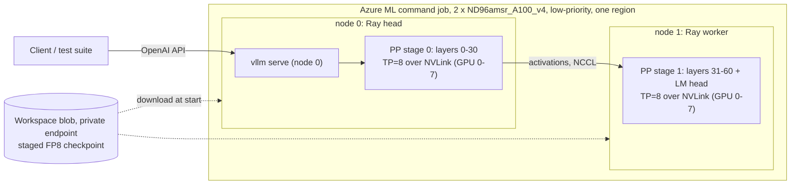

# A.X-K2 serving design: standard multi-node inference on A100

Snapshot: 2026-10-03. This supersedes the "blocked" conclusion in
[the handoff](HANDOFF.md) for the A100 path. Results of each stage are in
section 8 and in `evidence/`.

## 1. Method review: what was wrong before

**GPU cluster tools do not merge GPUs into one large GPU.** Slurm, Ray,
Kubernetes (KubeRay, LeaderWorkerSet, KAITO), CycleCloud and Azure ML only
*allocate nodes and start processes*. A distributed **inference engine**
(vLLM, SGLang, TensorRT-LLM) creates the "one model, one endpoint" experience:
it shards the weights with tensor/pipeline/expert parallelism, moves
activations with NCCL (NVLink inside a node, InfiniBand/Ethernet between
nodes), and serves one OpenAI-compatible API with continuous batching and a
paged KV cache. Rack-scale systems marketed as "one big GPU" still run model
parallelism underneath.

SKT serves A.X-K2 exactly this way. Their fork contains
`k2_dsa_test/scale_ab/serve_k2.sbatch`: Slurm `srun` with a pyxis/enroot
container image running `vllm serve --tensor-parallel-size 8` on one 8xB300
node. They deliberately chose TP over DP+EP because the DP/EP lock-step hung
in long-context evaluation.

The earlier work in this repository (`experiments/axk2_dist_*`) hand-wrote a
block runtime: FP32 dequantised weights, a custom loader, one blocking NCCL
send/receive per block and no batching, paged KV cache or API. It was a
correctness workaround for the missing SM80 sparse-attention kernels, **not a
serving method**, and it is kept only as a numerical oracle.

Best practice, which this design follows:

- One engine process group behind one endpoint. Common multi-node layout:
  **tensor parallel = GPUs per node** (NVLink), **pipeline parallel = number
  of nodes** (vLLM parallelism docs; KAITO multi-node presets; the Azure
  `inference-toolkit` sample serving Qwen3-235B on 2 x 8 A100 with TP8 x PP2).
- Identical container image and model path on every node; Ray (or Slurm, LWS)
  only forms the group.
- **One region and one network fabric.** Pooling quota from several regions
  into one model is not viable: every decode step would cross a WAN once per
  pipeline stage, and an eviction anywhere stops the whole engine. Separate
  regions can host separate *replicas* behind a load balancer, not one model.

## 2. Capacity without a quota increase

| Pool | Limit in this subscription | A100 80GB nodes it allows |
| --- | --- | --- |
| VM quota, A100 families (all regions checked) | 0 vCPU | 0 |
| VM Spot quota | 100 vCPU per region; increase requests throttled (429) | 1 x ND96amsr (96 vCPU) |
| **Azure ML low-priority compute** | **300 vCPU per region, no per-family cap** | **3 x ND96amsr_A100_v4 (24 GPUs)** |

`Standard_ND96amsr_A100_v4` (8 x A100 80GB, NVLink, InfiniBand) is
low-priority capable for Azure ML in swedencentral, westus2, uksouth,
francecentral, italynorth and polandcentral. Two nodes (192 vCPU, 16 GPUs,
1280 GB) hold the ~656 GiB FP8 weights at ~41 GiB per GPU and leave room for
KV cache. Azure ML retired low-priority VMs on 2026-03-31; such clusters are
now allocated and billed as **Spot**: preemptible, never above pay-as-you-go,
and the price cannot be capped. The Sweden Spot rate was USD 10.55 per node-hour.
See `evidence/azure-capacity-snapshot.json`.

## 3. Architecture

| Layer | PoC choice | Production equivalent |
| --- | --- | --- |
| Capacity | Azure ML compute cluster, low-priority ND96amsr x 2, min 0 nodes | Same SKU on demand/reserved in the customer subscription |
| Orchestration | One AML command job, `distribution: pytorch`, 1 process per node; script starts the Ray head/worker | AKS + KubeRay or LeaderWorkerSet (KAITO), or CycleCloud Slurm |
| Engine | vLLM 0.23.0 + SKT fork + TRITON_MLA_SPARSE port (section 5b), `--tensor-parallel-size 8 --pipeline-parallel-size 2 --distributed-executor-backend ray` | Same command and image |
| Kernels on SM80 | FP8 weight-only Marlin (linear and MoE). Native DSA: Triton MQA-logits indexer + Triton sparse MLA. Dense mode: Triton MLA decode, FlashAttention-2 MLA prefill | Same; Hopper/Blackwell use native FP8 and DSA kernels |

Files: `aml/src/entry.sh` (per-node launcher), `aml/jobs/*.yml`
(job templates), `aml/render_job.py`, `aml/fetch_results.py`, `aml/Dockerfile`.

## 4. Engine image: stock vLLM plus hash-verified fork sources

The SKT fork `axk2-v0.23.0` @ `023bc760` is upstream `v0.23.0` @ `0fc695fc`
plus 29 commits (47 files). Its single CUDA change, UE8M0 tile-scale rounding
in `cache_kernels.cu`, is gated to SM100 or `VLLM_DS_MLA_UE8M0_SCALE` and
cannot run on A100. All 21 modified Python files are byte-identical in the
released vLLM 0.23.0 wheel and the fork base. Copying the 25 fork Python
files over `vllm/vllm-openai:v0.23.0-cu129` therefore reproduces the fork's
Python tree exactly, with no CUDA rebuild. `aml/src/apply_overlay.py` checks the
installed version, each base-file hash, each downloaded fork-file hash and
the AXK2 registration (`aml/src/overlay_manifest.json`). `aml/Dockerfile`
bakes the same step into an image for production registries. The CUDA 12.9
image variant is used because CUDA 12 minor-version compatibility runs on
older host drivers; the default 0.23.0 image targets CUDA 13.

Two A100-specific changes came out of the first real run:

- **Ray is optional in vLLM 0.23** and absent from the image; the launcher
  installs `ray[cgraph]` (the documented step) before any vLLM process starts.
- **Ampere FP8 bug in MLA chunked-context prefill (upstream v0.23.0 too).**
  On SM80 the FP8 weights run through Marlin, which repacks
  `kv_b_proj.weight` into int32 tiles. The dtype guard in
  `_compute_prefill_context` then casts the BF16 activations to int32, and
  `marlin_gemm` fails with ``unsupported `a` scalar_type`` on the first prefill
  that continues from cached context (a chunked long prompt or a prefix-cache
  hit). Hopper is unaffected because its weights stay FP8. `apply_overlay.py`
  skips the cast for non-floating weight dtypes at both sites, after checking
  each anchor appears exactly once; FP8/BF16 behaviour on other GPUs is unchanged.

## 5. Dense mode: running DSA checkpoints without DSA kernels

The fork's DeepSeek-style sparse attention (DSA) indexer and sparse MLA
kernels need SM90/SM100 (FlashMLA sparse, DeepGEMM). The fork also supports
dense mode. `vllm/transformers_utils/configs/axk2.py` attaches the indexer
only when `index_topk`, `index_n_heads` and `index_head_dim` are present, and
the model loader skips indexer tensors otherwise ("so a DSA checkpoint can be
served as a plain AXK2 model"). `aml/src/make_dense_dir.py` symlinks every
checkpoint file and writes a config without those three keys.

DSA lets a query at position *p* attend to the top `index_topk` = 2048 of its
*p + 1* visible keys. While *p + 1* <= 2048, every key is selected, so DSA and
dense causal attention are **the same function**. Beyond 2048 tokens of
context, dense mode attends to more keys than the trained model: an
approximation whose quality must be measured (SKT evaluates with AA-LCR,
RULER and NIAH). DeepSeek uses the same identity in production: "for
short-sequence prefilling, we specially implement a masked MHA mode to
simulate DSA" (DeepSeek-V3.2-Exp report).

## 5b. Native DSA on A100: the TRITON_MLA_SPARSE port

Dense mode is no longer the only option. Upstream vLLM PR
[#38476](https://github.com/vllm-project/vllm/pull/38476) (open, not merged;
author's own description: "a concept") adds what A100 lacks:

- `TRITON_MLA_SPARSE`, a pure-Triton sparse MLA backend. It computes MQA over
  exactly the top-k selected latent KV entries, with a split-KV decode.
- A Triton implementation of DeepGEMM's FP8 MQA logits for the lightning
  indexer (prefill and paged decode). FP8 keys are decoded in-kernel, because
  SM80 has no FP8 tensor cores.
- Dispatch guards so DeepGEMM is never called where it is unsupported.

The PR was written against vLLM main from March 2026; the SKT fork is
v0.23.0 (June). `git apply --3way` applied it cleanly except
`sparse_attn_indexer.py`. There, the v0.23 XPU branch and the PR's Triton branch
were merged in the order XPU, then DeepGEMM, then Triton. One guard was added:
the PR put `TRITON_MLA_SPARSE` ahead of `FLASHMLA_SPARSE` in a priority list
that Hopper also uses, so the backend now declines SM90/SM100, which keep
their native kernels. `aml/src/dsa_port.json` records the result. It lists the
five new files, downloaded from the PR commit and hash-checked, and exact-context
diffs for the five modified files, each with an expected before-hash and
after-hash. Applied to the v0.23 + fork files offline, the port is
byte-identical to the merged git tree.

Interactions checked against v0.23:

- The XPU sparse base class the backend extends is unchanged since March.
- AXK2's indexer uses the same `SparseAttnIndexer` op and 64 heads (no padding).
- The 4D indexer cache view and 2D `seq_lens` already existed at the PR's base.
- `persistent_topk` (decode top-k) needs only SM70. Its long-context hang
  reported on the PR was fixed upstream by #41444 before v0.23.
- A later fix, #49139, is not in the v0.23 wheel. It affects a decode batch in
  which two sequences longer than 32K tokens are scheduled around a shorter
  one in the same CTA group. The tests here never batch two sequences longer
  than 32K.

In native mode the SKT checkpoint and config are served **unchanged**: no
config edits, and the indexer weights load. Every layer selects its top 2048
keys per query with the same rule as on B300. Individual near-tied keys can
still differ, because the kernels and their arithmetic differ.

## 5c. Differences from the reference single-node deployment

The reference is the model card command, `vllm serve skt/A.X-K2
--tensor-parallel-size <N> --tool-call-parser hermes --reasoning-parser
deepseek_v3`, validated on 4 x B300. SKT's own script serves it on one
8 x B300 node with TP8, `fastsafetensors`, `--max-model-len 131072` and the
BF16 KV-cache default. Every difference from that reference:

| Area | Reference (one B300/H100-class node) | This A100 deployment | Effect |
| --- | --- | --- | --- |
| Weights, config, tokenizer, chat template, model code | Checkpoint 2287ca45, SKT fork `axk2.py` | Same files, unmodified (native mode) | None |
| Linear and MoE matmuls | FP8 x FP8 on FP8 tensor cores (block-scaled W8A8) | FP8 weights expanded in-kernel, BF16 activations (Marlin W8A16); A100 has no FP8 tensor cores | Same weight memory; activations are not quantized; slower when compute-bound; not bit-identical |
| Indexer scores | DeepGEMM FP8 MQA logits | Triton kernel on the same FP8-quantized q/k, BF16 dot, FP32 accumulation (PR #38476) | Same inputs and rule, different kernel |
| Top-k selection | `persistent_topk` | Same kernel | None |
| Sparse MLA over the selected 2048 keys | FlashMLA / FlashInfer sparse | Triton sparse MLA (PR #38476, unmerged upstream) | Same computation; slower; not upstream-supported |
| KV cache | BF16 by default, FP8 (`fp8_ds_mla`) optional | BF16 only | No FP8-KV memory saving |
| Engine code | vLLM 0.23 + SKT fork | Same, plus the PR port and a 2-line A100 fix in `mla_attention.py` | Without the fix the server crashes on A100 |
| Parallelism | One node, TP 4 or 8, multiprocessing executor | Two nodes, TP8 x PP2 (layers 0-30 / 31-60), Ray | One network hop per token; losing either node stops the service |
| Inter-node network | Not applicable | NCCL over TCP, InfiniBand disabled in the PoC | Enable InfiniBand in production |
| Tool calling | `--tool-call-parser hermes` | **Not set and not tested** | Add and test before agentic use |
| Context length | 256K with no extra flags | `max_model_len` 65,536; tested to 60K | Longer contexts untested on A100 |
| Loader and limits | `fastsafetensors`, 64 sequences | Default loader, 128 sequences | Load time only |
| Determinism | Not batch-invariant by default | Same; the Triton sparse port cannot use batch-invariant mode yet | Identical requests can differ slightly |
| Quality evidence | SKT's published evaluations | Functional probes, needles, 2-layer log-probability comparison | Benchmark parity not measured |
| Speed | Not published per hardware | Measured on A100 only | No like-for-like comparison |

The `persistent_topk` fix #49139 is missing from every vLLM 0.23 build,
including SKT's own fork, so it is not an A100-specific gap.

## 6. Subscription policy constraints (MCAPS)

A management-group Azure Policy with a `modify` effect forces every storage
account to `publicNetworkAccess=Disabled` and `allowSharedKeyAccess=false`.
The design works within it and does not bypass it:

- Workspace managed VNet (`allow_internet_outbound`) with private endpoints
  to blob, file and Key Vault; system datastores in identity mode; each
  compute cluster has a system-assigned identity with Storage Blob Data
  Contributor on the workspace storage account only.
- The CLI cannot upload a `code:` snapshot from outside the VNet, and Batch
  rejects very long command lines. `aml/render_job.py` puts `aml/src` in the
  `AXK2_SRC_B64` environment variable (base64 tar.gz).
- Artifacts stay in private storage. Jobs report JSON summaries and
  zlib-compressed per-position series as chunked MLflow tags (ASCII-escaped,
  at most 90 tags per call, retried), read with `aml/fetch_results.py`
  through the workspace API. `aml/jobs/peek-run-logs.yml` and
  `collect-run-outputs.yml` read a job's streamed logs or finished outputs
  from inside the VNet.

## 7. Validation ladder

| Stage | What it proves | Cost |
| --- | --- | --- |
| A. CPU tiny AXK2 (`experiments/validate_dense_equivalence.py`) | Dense == sparse within `index_topk` for prefill and cached decode; divergence beyond it | none |
| B1. 2-layer real-weight cut, official Transformers FP32 sparse on CPU, prompts up to 7,166 tokens | Reference log-probabilities from SKT's own model definition | CPU minutes |
| B2. PR #38476 Triton kernel tests on A100 | The ported indexer-logits and sparse-MLA kernels against their references | minutes |
| B3. Same cut on the target nodes: vLLM native DSA and dense, single-node TP8, then native over Ray TP8 x PP2 | The exact launch path, overlay, DSA port and SM80 kernels on real weights; agreement with B1 inside and beyond `index_topk` | minutes of the C allocation |
| C. Full model on 2 x ND96amsr_A100_v4, TP8 x PP2, native and dense | Load and serve all 61 layers; functional, reasoning, accuracy, determinism, needles to 60K tokens, latency and throughput sweeps | ~USD 26/hour |

`aml/jobs/native-dsa-bench-nd96-hub.yml` runs B2, B3 and C in one allocation.
Both nodes download the full checkpoint from the Hub in the background while
B2 and B3 run. `aml/jobs/full-native-dense-nd96-hub.yml` runs only C. Spot
capacity was scarce, so the same job was queued in up to 12 regions.
`aml/first_capacity_wins.sh` picks the first region that holds both nodes,
cancels every other job and deletes any loser cluster that already holds
nodes.

## 8. Results

### 8.1 Native DSA versus dense on the same allocation (2026-10-03, italynorth)

All phases passed. Evidence: `evidence/a100-native-dsa-2layer-vs-official.json`,
`evidence/a100-native-vs-dense-full-model.json` and
`evidence/a100-native-dsa-deployment-log.json` (failures, fixes, cost).

**Kernels.** The 94 PR #38476 Triton kernel tests pass on A100. vLLM logs
confirm the paths used:

- **Native mode:** "DeepGEMM not supported on this platform; using Triton
  fallback for sparse attention indexer" and "Using TRITON_MLA_SPARSE
  attention backend".
- **Dense mode:** `TRITON_MLA`.
- **Both modes:** `MarlinFP8ScaledMMLinearKernel` for linear layers and the
  MARLIN FP8 MoE backend.

**Correctness on real weights.** The byte-exact 2-layer cut was compared
with the official Transformers implementation (FP32, sparse DSA) on 14,618
prompt positions. Of these, 7,262 lie beyond `index_topk`, in the 7.2K-token
model card. The table shows the mean |Δ log-probability| of the chosen token:

| vLLM on A100 | Inside `index_topk` | Beyond `index_topk` | Max beyond |
| --- | ---: | ---: | ---: |
| Native DSA, one node TP8 | 0.0116 | **0.0111** | 0.13 |
| Native DSA, two nodes TP8 x PP2 | 0.0120 | **0.0115** | - |
| Dense, one node TP8 | 0.0116 | 0.0123 | 0.22 |

Inside `index_topk` both modes compute the same function, and 0.0116 is the
BF16-versus-FP32 floor. Beyond it, native stays at that floor while dense
drifts. Dense and native differ from each other 2.4 times more beyond
`index_topk` (0.0120) than inside it (0.0051). Native therefore reproduces
the trained sparse attention. Two layers bound the size of the effect; the
full model cannot run in the FP32 CPU reference.

**Full 688B model, one endpoint, 16 x A100 80GB.** Settings: TP8 x PP2,
`max_model_len` 65,536, up to 128 sequences.

| | Native DSA | Dense |
| --- | --- | --- |
| Healthy after launch | 302 s | 171 s |
| Weights / KV cache per GPU | 42.2 GiB / 26.4 GiB | 41.7 GiB / 26.8 GiB |
| KV cache capacity | 724,544 tokens | 821,312 tokens |
| Functional (Korean/English, translation, code) | 6/6 | 6/6 |
| Reasoning mode | correct | correct |
| Needles at 1.4K / 8K / 30K / 60K tokens, 3 depths each | 12/12 | 12/12 |
| Arithmetic without thinking | 14/20 | 14/20 |
| Two identical greedy requests bitwise equal | no | no |

All six arithmetic misses ended normally (`stop`), with a wrong number, for
example 86 x 8 + 83 answered as 761. That is the model's no-thinking mental
arithmetic, not truncation; the same kind of problem was answered correctly
in reasoning mode.

The speed results below come from `vllm bench serve` with random-token prompts,
256 output tokens and `--ignore-eos`.

| Scenario | Native: output tok/s | Native: median TTFT | Native: median TPOT | Dense: output tok/s | Dense: median TTFT | Dense: median TPOT |
| --- | ---: | ---: | ---: | ---: | ---: | ---: |
| 1 request, 1K input | 49 | 355 ms | 19.2 ms | 60 | 199 ms | 15.8 ms |
| 1 request, 8K input | 38 | 1.65 s | 20.0 ms | 50 | 0.85 s | 16.7 ms |
| 1 request, 32K input | 20 | 7.21 s | 21.1 ms | 31 | 3.33 s | 19.1 ms |
| 1K input, concurrency 8 | 216 | 1.51 s | 31.0 ms | 243 | 1.09 s | 28.4 ms |
| 1K input, concurrency 32 | 360 | 1.83 s | 76.7 ms | 494 | 0.99 s | 58.1 ms |
| 1K input, concurrency 64 | 618 | 1.70 s | 90.3 ms | 707 | 0.76 s | 85.8 ms |
| 1K input, concurrency 128 | 812 | 2.94 s | 145.5 ms | 898 | 1.20 s | 132.9 ms |
| 16K input, concurrency 4 | 53 | 6.30 s | 43.5 ms | 69 | 4.92 s | 37.5 ms |
| 16K input, concurrency 16 | 51 | 25.4 s | 208 ms | 84 | 13.1 s | 140 ms |

The two modes trade exactness for speed:

- **Native keeps the trained sparse-attention rule** (top 2048 keys per
  query), computed with substitute kernels. Its decode cost per token is
  almost flat from 1K to 32K tokens of context (19.2 to 21.1 ms), as designed.
  The port is still unoptimized Triton, and the PR author calls it
  "a concept".
- **Dense on A100 is 10-60% faster.** Prefill uses the mature FlashAttention-2
  path, and decode attention is cheap at these context lengths. Its decode
  cost grows with context (15.8 to 19.1 ms), so the gap narrows. It is exact
  only up to 2,048 context tokens.

Which mode to choose depends on the workload. Native is the configuration
closest to the reference at long context. Dense is defensible when prompts
plus output stay short or when a long-context evaluation accepts it.

### 8.2 First full-model run, dense only (2026-10-02, italynorth)

Evidence: `evidence/axk2-dense-equivalence-cpu.json`,
`evidence/a100-2layer-vs-official.json`,
`evidence/a100-full-model-tp8-pp2-results.json` and
`evidence/a100-deployment-attempts.json` (every failure and fix).

**B: real weights, vLLM on A100 vs official Transformers (FP32, sparse DSA).**
Chosen-token log-probability over ~3,300 prompt positions:

| vLLM configuration | Pearson | Mean abs diff | Top-1 agreement |
| --- | --- | --- | --- |
| Single node, TP8 | 0.99995-0.999996 | 0.008-0.013 | 97-100% |
| Two nodes, TP8 x PP2 | 0.99998-0.999996 | 0.008-0.013 | 93-100% |

This is the expected agreement between BF16 activations and an FP32
reference. Two-node and single-node greedy tokens were identical, and 8
concurrent requests all completed.

**C: full 688B model, one endpoint on 16 x A100 80GB (2 x ND96amsr, TP8 x PP2).**

- Kernels selected by vLLM on SM80: `MarlinFP8ScaledMMLinearKernel` for
  linears, the MARLIN FP8 MoE backend, TRITON_MLA decode and FLASH_ATTN MLA
  prefill; ranks 0-7 on node 0 and 8-15 on node 1.
- Weights: 41.7 GiB per GPU, loaded in ~78 s from page cache (the 694 GB
  download took ~640 s per node at ~1.1 GB/s from the Hub, overlapped with B2).
  The server was healthy 181 s after launch: engine initialisation took
  50 s, including torch.compile and CUDA graphs.
- KV cache: 27.6 GiB per GPU, 843,920 tokens, which is 103 concurrent
  8K-token requests.

| Test | Result |
| --- | --- |
| Korean/English functional chat, translation, code | 6/6 correct |
| Reasoning mode (`<think>`) | Correct, with reasoning trace |
| Needle at 1,380 tokens (exact DSA region) / 5,469 tokens (dense approximation) | Found / found |
| Short no-thinking arithmetic, 24-token cap | 14/20 (individual answers not recorded) |
| Two identical greedy requests | Not bitwise identical (default kernels are not batch-invariant) |
| Single stream | TTFT 72 ms, ~75 tokens/s |

Synthetic load, 1024-token prompts, 128 output tokens:

| Concurrency | Output tok/s | Total tok/s | Median TTFT | Median TPOT |
| ---: | ---: | ---: | ---: | ---: |
| 1 | 65 | 581 | 198 ms | 14.0 ms |
| 8 | 228 | 2,052 | 917 ms | 26.1 ms |
| 32 | 472 | 4,245 | 984 ms | 57.1 ms |

Spend was about USD 34: 61 minutes of the winning 2-node cluster, 6
minutes of a duplicate allocation that was cancelled, and CPU jobs.
Everything was deleted afterwards. The native-DSA round (8.1) cost about
USD 71 more, mostly 2.5 hours of the italynorth cluster; it was deleted too.

## 9. Known limits and next steps

- Low-priority/Spot capacity can be preempted and was scarce: 2 x ND96amsr
  was available in two of twelve regions when asked. Production needs
  on-demand or reserved capacity in the customer subscription. Run the
  same image and command there, on AKS + KubeRay/LWS or CycleCloud Slurm.
- Native DSA depends on an unmerged upstream PR carried as a hash-checked
  overlay. Re-validate (kernel tests plus the 2-layer comparison in
  `native-dsa-bench-nd96-hub.yml`) before moving to another vLLM version, and
  prefer upstream support once it lands.
- The v0.23 `persistent_topk` decode kernel lacks upstream fix #49139 (two
  sequences longer than 32K tokens batched around a shorter one). Serving
  many concurrent sequences longer than 32K tokens should wait for a vLLM
  build that includes it.
- Needles, functional probes and the 2-layer comparison are not a full
  quality evaluation; run AA-LCR, RULER or the customer's own set, in both
  modes if dense is considered.
- Output is not bitwise reproducible across identical requests with the
  default kernels; use vLLM's batch-invariant mode if exact reproducibility
  is required (the Triton sparse port does not wire it yet).
- The PoC disables InfiniBand for NCCL (`NCCL_IB_DISABLE=1`); pipeline-parallel
  traffic between the two stages is one hidden-state tensor per step. Enable
  IB in production once the container's RDMA userland is verified; the
  `/dev/infiniband` devices were visible inside the job containers.
- Hub downloads of 694 GB can stall (observed once at 68%); the watchdog in
  `stage_weights.py` restarts and resumes. Production should stage the
  weights once into same-region storage or an image cache.
- Throughput tuning (expert parallelism, data-parallel replicas, speculative
  decoding, `fastsafetensors` loading) is out of scope for this proof.
