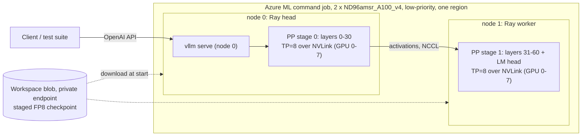

# A.X-K2 serving design: standard multi-node inference on A100

Snapshot: 2026-10-03. This supersedes the "blocked" conclusion in
[the handoff](HANDOFF.md) for the A100 path. Results of each stage are in
section 8 and in `evidence/`.

## 1. Method review: what was wrong before

**GPU cluster tools do not merge GPUs into one large GPU.** Slurm, Ray,
Kubernetes (KubeRay, LeaderWorkerSet, KAITO), CycleCloud and Azure ML only
*allocate nodes and start processes*. A distributed **inference engine**
(vLLM, SGLang, TensorRT-LLM) creates the "one model, one endpoint" experience:
it shards the weights with tensor/pipeline/expert parallelism, moves
activations with NCCL (NVLink inside a node, InfiniBand/Ethernet between
nodes), and serves one OpenAI-compatible API with continuous batching and a
paged KV cache. Rack-scale systems marketed as "one big GPU" still run model
parallelism underneath.

SKT serves A.X-K2 exactly this way. Their fork contains
`k2_dsa_test/scale_ab/serve_k2.sbatch`: Slurm `srun` with a pyxis/enroot
container image running `vllm serve --tensor-parallel-size 8` on one 8xB300
node. They deliberately chose TP over DP+EP because the DP/EP lock-step hung
in long-context evaluation.

The earlier work in this repository (`experiments/axk2_dist_*`) hand-wrote a
block runtime: FP32 dequantised weights, a custom loader, one blocking NCCL
send/receive per block and no batching, paged KV cache or API. It was a
correctness workaround for the missing SM80 sparse-attention kernels, **not a
serving method**, and it is kept only as a numerical oracle.

Best practice, which this design follows:

- One engine process group behind one endpoint. Common multi-node layout:
  **tensor parallel = GPUs per node** (NVLink), **pipeline parallel = number
  of nodes** (vLLM parallelism docs; KAITO multi-node presets; the Azure
  `inference-toolkit` sample serving Qwen3-235B on 2 x 8 A100 with TP8 x PP2).
- Identical container image and model path on every node; Ray (or Slurm, LWS)
  only forms the group.
- **One region and one network fabric.** Pooling quota from several regions
  into one model is not viable: every decode step would cross a WAN once per
  pipeline stage, and an eviction anywhere stops the whole engine. Separate
  regions can host separate *replicas* behind a load balancer, not one model.

## 2. Capacity without a quota increase

| Pool | Limit in this subscription | A100 80GB nodes it allows |
| --- | --- | --- |
| VM quota, A100 families (all regions checked) | 0 vCPU | 0 |
| VM Spot quota | 100 vCPU per region; increase requests throttled (429) | 1 x ND96amsr (96 vCPU) |
| **Azure ML low-priority compute** | **300 vCPU per region, no per-family cap** | **3 x ND96amsr_A100_v4 (24 GPUs)** |

`Standard_ND96amsr_A100_v4` (8 x A100 80GB, NVLink, InfiniBand) is
low-priority capable for Azure ML in swedencentral, westus2, uksouth,
francecentral, italynorth and polandcentral. Two nodes (192 vCPU, 16 GPUs,
1280 GB) hold the ~656 GiB FP8 weights at ~41 GiB per GPU and leave room for
KV cache. Azure ML retired low-priority VMs on 2026-03-31; such clusters are
now allocated and billed as **Spot**: preemptible, never above pay-as-you-go,
and the price cannot be capped. The Sweden Spot rate was USD 10.55 per node-hour.
See `evidence/azure-capacity-snapshot.json`.

## 3. Architecture

| Layer | PoC choice | Production equivalent |
| --- | --- | --- |
| Capacity | Azure ML compute cluster, low-priority ND96amsr x 2, min 0 nodes | Same SKU on demand/reserved in the customer subscription |
| Orchestration | One AML command job, `distribution: pytorch`, 1 process per node; script starts the Ray head/worker | AKS + KubeRay or LeaderWorkerSet (KAITO), or CycleCloud Slurm |
| Engine | vLLM 0.23.0 + SKT fork, `--tensor-parallel-size 8 --pipeline-parallel-size 2 --distributed-executor-backend ray` | Same command and image |
| Kernels on SM80 | FP8 weight-only Marlin (linear and MoE), Triton MLA decode, FlashAttention-2 MLA prefill | Same; Hopper/Blackwell use native FP8 and DSA kernels |

Files: `aml/src/entry.sh` (per-node launcher), `aml/jobs/*.yml`
(job templates), `aml/render_job.py`, `aml/fetch_results.py`, `aml/Dockerfile`.

## 4. Engine image: stock vLLM plus hash-verified fork sources

The SKT fork `axk2-v0.23.0` @ `023bc760` is upstream `v0.23.0` @ `0fc695fc`
plus 29 commits (47 files). Its single CUDA change, UE8M0 tile-scale rounding
in `cache_kernels.cu`, is gated to SM100 or `VLLM_DS_MLA_UE8M0_SCALE` and
cannot run on A100. All 21 modified Python files are byte-identical in the
released vLLM 0.23.0 wheel and the fork base. Copying the 25 fork Python
files over `vllm/vllm-openai:v0.23.0-cu129` therefore reproduces the fork's
Python tree exactly, with no CUDA rebuild. `aml/src/apply_overlay.py` checks the
installed version, each base-file hash, each downloaded fork-file hash and
the AXK2 registration (`aml/src/overlay_manifest.json`). `aml/Dockerfile`
bakes the same step into an image for production registries. The CUDA 12.9
image variant is used because CUDA 12 minor-version compatibility runs on
older host drivers; the default 0.23.0 image targets CUDA 13.

Two A100-specific changes came out of the first real run:

- **Ray is optional in vLLM 0.23** and absent from the image; the launcher
  installs `ray[cgraph]` (the documented step) before any vLLM process starts.
- **Ampere FP8 bug in MLA chunked-context prefill (upstream v0.23.0 too).**
  On SM80 the FP8 weights run through Marlin, which repacks
  `kv_b_proj.weight` into int32 tiles. The dtype guard in
  `_compute_prefill_context` then casts the BF16 activations to int32, and
  `marlin_gemm` fails with ``unsupported `a` scalar_type`` on the first prefill
  that continues from cached context (a chunked long prompt or a prefix-cache
  hit). Hopper is unaffected because its weights stay FP8. `apply_overlay.py`
  skips the cast for non-floating weight dtypes at both sites, after checking
  each anchor appears exactly once; FP8/BF16 behaviour on other GPUs is unchanged.

## 5. Dense mode: running DSA checkpoints without DSA kernels

The fork's DeepSeek-style sparse attention (DSA) indexer and sparse MLA
kernels need SM90/SM100 (FlashMLA sparse, DeepGEMM). The fork also supports
dense mode. `vllm/transformers_utils/configs/axk2.py` attaches the indexer
only when `index_topk`, `index_n_heads` and `index_head_dim` are present, and
the model loader skips indexer tensors otherwise ("so a DSA checkpoint can be
served as a plain AXK2 model"). `aml/src/make_dense_dir.py` symlinks every
checkpoint file and writes a config without those three keys.

DSA lets a query at position *p* attend to the top `index_topk` = 2048 of its
*p + 1* visible keys. While *p + 1* <= 2048, every key is selected, so DSA and
dense causal attention are **the same function**. Beyond 2048 tokens of
context, dense mode attends to more keys than the trained model: an
approximation whose quality must be measured (SKT evaluates with AA-LCR,
RULER and NIAH). DeepSeek uses the same identity in production: "for
short-sequence prefilling, we specially implement a masked MHA mode to
simulate DSA" (DeepSeek-V3.2-Exp report).

## 6. Subscription policy constraints (MCAPS)

A management-group Azure Policy with a `modify` effect forces every storage
account to `publicNetworkAccess=Disabled` and `allowSharedKeyAccess=false`.
The design works within it and does not bypass it:

- Workspace managed VNet (`allow_internet_outbound`) with private endpoints
  to blob, file and Key Vault; system datastores in identity mode; each
  compute cluster has a system-assigned identity with Storage Blob Data
  Contributor on the workspace storage account only.
- The CLI cannot upload a `code:` snapshot from outside the VNet, and Batch
  rejects very long command lines. `aml/render_job.py` puts `aml/src` in the
  `AXK2_SRC_B64` environment variable (base64 tar.gz).
- Artifacts stay in private storage. Jobs report JSON summaries as chunked
  MLflow tags and per-position series as MLflow metrics, read with
  `aml/fetch_results.py` through the workspace API.

## 7. Validation ladder

| Stage | What it proves | Cost |
| --- | --- | --- |
| A. CPU tiny AXK2 (`experiments/validate_dense_equivalence.py`) | Dense == sparse within `index_topk` for prefill and cached decode; divergence beyond it | none |
| B1. 2-layer real-weight cut, official Transformers FP32 sparse on CPU | Reference log-probabilities from SKT's own model definition | CPU minutes |
| B2. Same cut on the target nodes: vLLM dense, single-node TP8, then Ray TP8 x PP2 across both nodes | The exact launch path, overlay and SM80 kernels on real weights, multi-node parity, agreement with B1 | minutes of the C allocation |
| C. Full model on 2 x ND96amsr_A100_v4, TP8 x PP2, same Ray cluster as B2 | Load and serve all 61 layers; functional, reasoning, accuracy, determinism, long-context and load tests | ~USD 26/hour |

`aml/jobs/rehearse-then-serve-nd96-hub.yml` runs B2 and C in one allocation:
both nodes download the full checkpoint from the Hub in the background
while B2 runs, and C starts only if B2 passes. Because Spot capacity was
scarce, the same job was queued in several regions, and
`aml/first_capacity_wins.sh` cancelled every other region once one region
had both nodes.

## 8. Results (2026-10-02, italynorth)

All stages passed. Evidence: `evidence/axk2-dense-equivalence-cpu.json`,
`evidence/a100-2layer-vs-official.json`,
`evidence/a100-full-model-tp8-pp2-results.json` and
`evidence/a100-deployment-attempts.json` (every failure and fix).

**B: real weights, vLLM on A100 vs official Transformers (FP32, sparse DSA).**
Chosen-token log-probability over ~3,300 prompt positions:

| vLLM configuration | Pearson | Mean abs diff | Top-1 agreement |
| --- | --- | --- | --- |
| Single node, TP8 | 0.99995-0.999996 | 0.008-0.013 | 97-100% |
| Two nodes, TP8 x PP2 | 0.99998-0.999996 | 0.008-0.013 | 93-100% |

This is the expected agreement between BF16 activations and an FP32
reference. Two-node and single-node greedy tokens were identical, and 8
concurrent requests all completed.

**C: full 688B model, one endpoint on 16 x A100 80GB (2 x ND96amsr, TP8 x PP2).**

- Kernels selected by vLLM on SM80: `MarlinFP8ScaledMMLinearKernel` for
  linears, the MARLIN FP8 MoE backend, TRITON_MLA decode and FLASH_ATTN MLA
  prefill; ranks 0-7 on node 0 and 8-15 on node 1.
- Weights: 41.7 GiB per GPU, loaded in ~78 s from page cache (the 694 GB
  download took ~640 s per node at ~1.1 GB/s from the Hub, overlapped with B2).
  The server was healthy 181 s after launch: engine initialisation took
  50 s, including torch.compile and CUDA graphs.
- KV cache: 27.6 GiB per GPU, 843,920 tokens, which is 103 concurrent
  8K-token requests.

| Test | Result |
| --- | --- |
| Korean/English functional chat, translation, code | 6/6 correct |
| Reasoning mode (`<think>`) | Correct, with reasoning trace |
| Needle at 1,380 tokens (exact DSA region) / 5,469 tokens (dense approximation) | Found / found |
| Short no-thinking arithmetic, 24-token cap | 14/20 (individual answers not recorded) |
| Two identical greedy requests | Not bitwise identical (default kernels are not batch-invariant) |
| Single stream | TTFT 72 ms, ~75 tokens/s |

Synthetic load, 1024-token prompts, 128 output tokens:

| Concurrency | Output tok/s | Total tok/s | Median TTFT | Median TPOT |
| ---: | ---: | ---: | ---: | ---: |
| 1 | 65 | 581 | 198 ms | 14.0 ms |
| 8 | 228 | 2,052 | 917 ms | 26.1 ms |
| 32 | 472 | 4,245 | 984 ms | 57.1 ms |

Spend was about USD 34: 61 minutes of the winning 2-node cluster, 6
minutes of a duplicate allocation that was cancelled, and CPU jobs.
Everything was deleted afterwards.

## 9. Known limits and next steps

- Low-priority/Spot capacity can be preempted and was scarce: 2 x ND96amsr
  could not be allocated in four of six regions on the test day. Production
  needs on-demand or reserved capacity in the customer subscription. Run the
  same image and command there, on AKS + KubeRay/LWS or CycleCloud Slurm.
- Dense mode beyond 2048 context tokens is only probed by one needle test
  here; it needs a quality evaluation (for example AA-LCR, RULER) before
  long-context production use. A native SM80 DSA backend (a Triton indexer
  plus sparse MLA over the selected indices) would remove the approximation.
- The arithmetic probe (14/20) did not record individual answers; repeat it
  with thinking enabled and per-item logging before drawing conclusions.
- Output is not bitwise reproducible across identical requests with the
  default kernels; use vLLM's batch-invariant mode if exact reproducibility
  is required.
- The PoC disables InfiniBand for NCCL (`NCCL_IB_DISABLE=1`); pipeline-parallel
  traffic between the two stages is one hidden-state tensor per step. Enable
  IB in production once the container's RDMA userland is verified; the
  `/dev/infiniband` devices were visible inside the job containers.
- Throughput tuning (expert parallelism, data-parallel replicas, speculative
  decoding, `fastsafetensors` loading) is out of scope for this proof.
