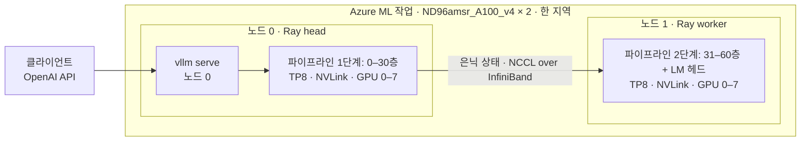
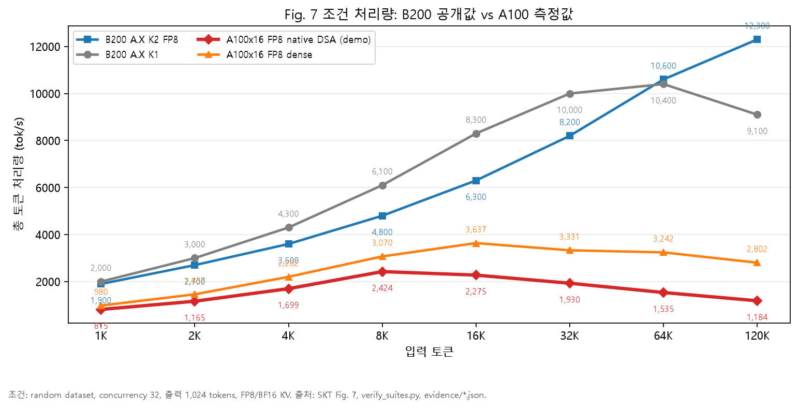
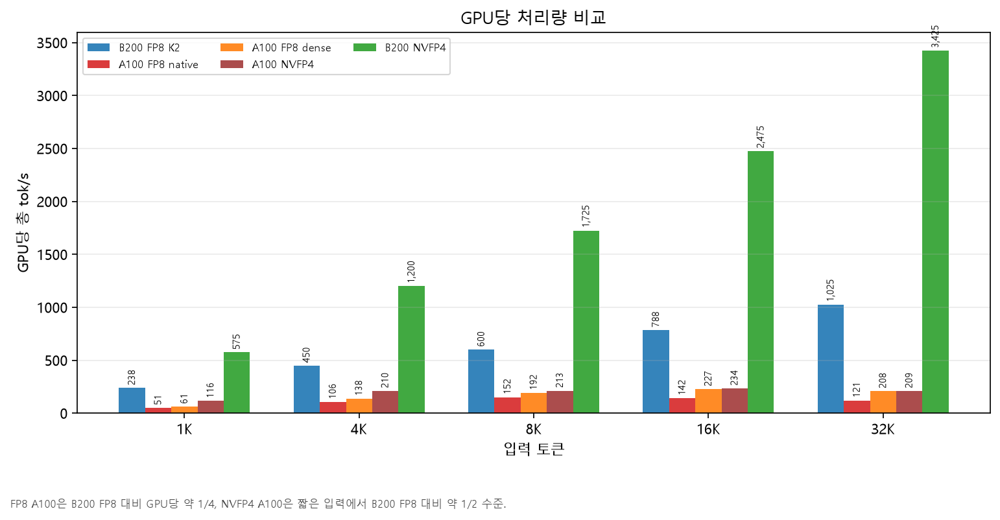
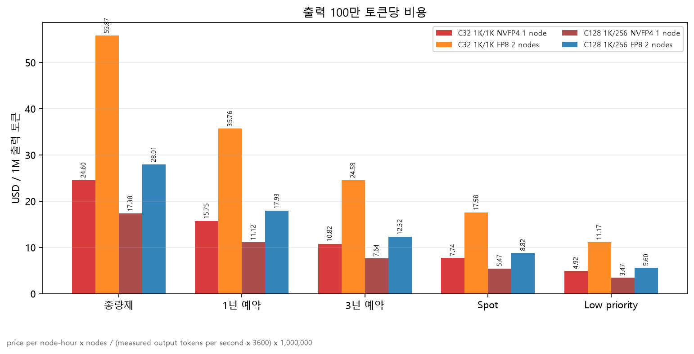

# A.X K2를 H100 없이 Azure A100 16장으로 서빙하기 — 기술 보고서

작성: Microsoft Korea · 기준일 2026-10 · 대상 모델 [skt/A.X-K2](https://huggingface.co/skt/A.X-K2)

## 1. 요약

- **결론.** SKT A.X K2(총 688B, 활성 33B, FP8, MoE, DeepSeek Sparse Attention)를 **H100/B200 없이**
  Azure의 **Standard_ND96amsr_A100_v4 2대(A100 80GB × 16)** 에서 원본 가중치 그대로 서빙했습니다.
  OpenAI 호환 API 하나로 채팅·추론(thinking)·툴 호출·25만 토큰 문맥까지 동작합니다.
- **핵심 난제는 세 가지였습니다.** ① 한 대(8장)에 FP8 가중치 694 GB가 안 들어감,
  ② A100에는 FP8 텐서 코어가 없음, ③ 모델의 희소 어텐션(DSA) 커널이 H100/B200 전용.
- **해결.** ① 두 노드를 vLLM 하나로 묶어 **노드 안은 텐서 병렬(TP8), 노드 사이는 파이프라인 병렬(PP2)**,
  노드 간 통신은 InfiniBand. ② FP8 가중치를 커널 안에서 BF16으로 풀어 계산하는 **Marlin W8A16** 커널.
  ③ 업스트림 vLLM의 미병합 PR #38476(**Triton DSA 커널**)을 SKT vLLM 포크에 이식하고,
  A100에서만 나는 버그 1건(MLA 프리필 dtype)을 2줄로 수정.
- **검증.** 툴 호출 9/9, SKT 자체 니들 테스트 9/9(최대 252,728 토큰), 노드 간 InfiniBand 20.6 GB/s.
- **속도.** 단일 사용자 49 tok/s(1K 입력), 동시 128명 합계 812 tok/s.
  SKT 기술보고서 Fig. 7 조건에서 **B200 1노드의 0.43–0.51배**(1K–8K 입력, GPU 16장 vs 8장).
- **비용.** 2노드 시간당 약 $82(종량제) / 약 $16(Azure ML 저우선).
- **데모.** 비밀번호로 보호되는 웹 챗봇이 실제 2노드 클러스터에 연결되어 있습니다(9장).

## 2. 과제와 제약

| 항목 | 내용 |
|---|---|
| 모델 | A.X K2: 61층, MoE(라우팅 전문가) + MLA 어텐션 + DSA(쿼리마다 상위 2,048개 키만 보는 희소 어텐션), FP8 블록 양자화 체크포인트 694 GB, 최대 문맥 262,144 |
| SKT 기준 환경 | B300/B200 한 노드(4–8장), `vllm serve --tensor-parallel-size 8` |
| 우리 조건 | H100/H200/B200 확보 불가. 더 작은/구형 GPU 여러 대로, 고객이 쓰는 Azure 구독 안에서 |
| 구독 제약 | A100 VM 쿼터 0, Spot 쿼터 지역당 100 vCPU, 스토리지 공용 접근 차단 정책 |

## 3. 한계점 — 무엇이 막혔나

| # | 한계 | 왜 문제인가 |
|---|---|---|
| L1 | **메모리**: FP8 가중치 694 GB > A100 8장 640 GB | 한 노드에 모델이 안 올라감. 여러 노드를 "하나의 모델"로 묶어야 함 |
| L2 | **FP8 연산 불가**: A100(SM80)에는 FP8 텐서 코어가 없음 | 기준 환경의 FP8×FP8 행렬곱(W8A8) 커널이 동작하지 않음 |
| L3 | **DSA 커널 부재**: 인덱서(DeepGEMM FP8 MQA logits)와 희소 MLA(FlashMLA sparse)가 SM90/SM100 전용 | 모델 고유의 희소 어텐션을 A100에서 계산할 방법이 없음 |
| L4 | **A100 전용 버그**: MLA 청크 프리필에서 Marlin이 재배치한 int32 가중치 dtype으로 활성값을 캐스팅 | 긴 프롬프트·프리픽스 캐시 적중 시 서버가 죽음(업스트림 v0.23.0에도 존재) |
| L5 | **노드 간 통신**: 기본 설정은 TCP(0.35 GB/s) | 프리필 시 단계 간 은닉 상태 전송이 느림, 노드 걸친 TP는 불가능한 수준 |
| L6 | **GPU 확보**: A100 VM 쿼터 0, 증설 요청 지연 | VM으로는 노드 하나도 못 띄움 |
| L7 | **툴 호출**: 모델 카드 명령만으로는 `tool_choice: auto` 결과가 본문 텍스트로 나옴 | 에이전트/함수 호출 시나리오가 깨짐 (A100과 무관, 기준 명령에도 해당) |

## 4. 해결 — 어떤 연산을 무엇으로 바꿨나

| 한계 | 바꾼 것 | 어떻게 | 결과 |
|---|---|---|---|
| L1 메모리 | 단일 노드 → **2노드 TP8 × PP2** | vLLM `--tensor-parallel-size 8 --pipeline-parallel-size 2 --distributed-executor-backend ray`. 노드 0: 0–30층, 노드 1: 31–60층 + LM 헤드. GPU당 약 41 GiB 가중치, 나머지는 KV 캐시 | 전체 61층 로드·서빙, KV 캐시 673,792 토큰 |
| L2 FP8 연산 | FP8×FP8 행렬곱(W8A8) → **Marlin W8A16** | FP8 가중치는 메모리에 그대로 두고 커널 안에서 BF16으로 풀어 BF16 활성값과 곱함(선형층·MoE 전문가 모두) | 가중치 메모리는 동일. 디코드는 가중치 읽기가 병목이라 영향이 작고, 프리필은 느려짐 |
| L3 DSA | DeepGEMM 인덱서 + FlashMLA sparse → **Triton 인덱서 + Triton 희소 MLA** | vLLM PR #38476을 SKT 포크(v0.23)에 이식. 충돌 1건 수동 병합, H100/B200은 기존 커널을 쓰도록 가드 추가. 파일별 해시로 검증하는 오버레이(`aml/src/dsa_port.json`) | 체크포인트·설정 **무수정**. 모든 층이 B300과 같은 규칙으로 쿼리당 상위 2,048 키 선택. 25만 토큰 니들 9/9 |
| L4 버그 | dtype 캐스팅 조건 | 가중치가 부동소수점 타입일 때만 캐스팅하도록 2곳 수정(앵커 1회 등장 확인 후 패치) | 긴 프롬프트·캐시 적중에서 안정 |
| L5 통신 | TCP → **InfiniBand + GPUDirect RDMA** | 컨테이너에 노출된 200 Gb/s HCA 8개 사용, Azure NDv4 토폴로지 파일 적용, 시작 시 NCCL 프로브로 IB 확인 후에만 사용 | 20.6 GB/s(57배), 왕복 454 → 122 µs, 8K 청크 단계 전송 0.67 s → 11 ms |
| L6 확보 | VM → **Azure ML 저우선(low priority) 클러스터** | 지역당 300 vCPU, 패밀리 제한 없음 → ND96amsr 3대까지. 3개 지역(uksouth·italynorth·francecentral)에 동시 제출하고 먼저 2노드를 받은 곳만 남김 | 쿼터 증설 없이 확보. 단, 회수(preemption) 가능 |
| L7 툴 | 파서 설정 | `--tool-call-parser hermes --enable-auto-tool-choice` | 9/9 정답(한국어 호출, 병렬 호출, thinking+호출, 스트리밍, named, required 등) |

### 병렬 구성 한눈에 보기

**"앞뒤로 나누면 순차 처리 아닌가?"** 한 요청만 보면 그렇습니다. 토큰 하나를 만들 때 1단계(0–30층)를 지나
2단계(31–60층)로 갑니다. 하지만 ① 각 단계 **안에서는** 8장이 한 층의 행렬을 나눠 동시에 계산하고(텐서 병렬),
② 여러 요청이 있을 때는 1단계가 다음 묶음을 처리하는 동안 2단계가 이전 묶음을 처리합니다(파이프라인 병렬).
그래서 동시 사용자가 늘수록 합계 처리량이 올라갑니다(1명 49 → 128명 812 tok/s).
노드를 나누는 근본 이유는 속도가 아니라 **메모리**(L1)이고, 노드 사이에 오가는 것은 층 경계의 작은 은닉 상태뿐이라
노드 간 대역폭 요구가 작습니다. 노드 전체를 하나의 TP16으로 묶는 구성도 시험했는데(짧은 입력에서 12–41% 빠름),
KV 캐시가 절반이 되어 긴 문맥에 불리합니다.

### 기준 환경과 달라진 점

| 영역 | SKT 기준(B200/B300 한 노드) | 이번 A100 구성 |
|---|---|---|
| 가중치·설정·토크나이저·채팅 템플릿 | 원본 | **원본 그대로** |
| 행렬곱 | FP8 텐서 코어 W8A8 | Marlin W8A16 (활성값 BF16) |
| DSA 인덱서·희소 MLA | DeepGEMM / FlashMLA | Triton(PR #38476 이식) |
| KV 캐시 | BF16(기본) | BF16 |
| 병렬 | TP4–8, 한 노드 | TP8 × PP2, 두 노드(Ray) |
| 엔진 | vLLM 0.23 + SKT 포크 | 동일 + DSA 이식 + A100 버그 수정 2줄 |
| 툴 호출 | hermes 파서 | hermes + auto tool choice |
| 추측 디코딩(EAGLE3) | +23–30% | **사용 불가**(PP와 비호환, A100 MLA 디코드 커널이 다중 토큰 검증 미지원) |

## 5. 검증 결과

| 항목 | 결과 |
|---|---|
| 전체 61층 로드·서빙 | 성공 (OpenAI 호환 엔드포인트 1개) |
| 툴 호출 9종 | **9/9** (한국어 단일 호출, 병렬 2건, 인자 3개, thinking+호출, 불필요 시 미호출, 결과 반영 후속 턴, 스트리밍, named, required) |
| SKT 니들 테스트 32K / 128K / 256K | **9/9** (최대 252,728 토큰, 요청당 125–167초) |
| 노드 간 InfiniBand | 20.6 GB/s per GPU pair (TCP 0.35 GB/s), all-reduce 18.2 GB/s |
| 2층 실가중치 비교 | SKT 공식 Transformers 구현(FP32, 희소 DSA) 대비 14,618개 위치에서 선택 토큰 로그확률 평균 오차 0.0115(2,048 키 이후), BF16 대비 FP32 하한(0.0116)과 같은 수준 → 학습된 희소 어텐션을 재현 |
| 결정성 | 동일 그리디 요청도 68–264자 이후 달라짐. vLLM 배치 불변 모드는 A100 FP8 MoE에서 시작 불가 |

### 속도

`vllm bench serve`, 랜덤 프롬프트, 출력 256 토큰.

| 시나리오 | 출력 tok/s | TTFT 중앙값 | 토큰당 시간(TPOT) |
|---|---:|---:|---:|
| 1명, 1K 입력 | 49 | 355 ms | 19.2 ms |
| 1명, 8K 입력 | 38 | 1.65 s | 20.0 ms |
| 1명, 32K 입력 | 20 | 7.21 s | 21.1 ms |
| 동시 32명, 1K 입력 | 360 | 1.83 s | 76.7 ms |
| 동시 128명, 1K 입력 | 812 | 2.94 s | 145.5 ms |

DSA 덕분에 토큰당 디코드 시간은 1K→32K 문맥에서 거의 평탄합니다(19.2 → 21.1 ms).

### SKT 기술보고서 Fig. 7 조건 비교 (동시 32, 출력 1,024, 총 tok/s)

| 입력 | B200 1노드(8장, 공개값) | A100 16장 | 비율 |
|---:|---:|---:|---:|
| 1K | 1,900 | 815 | 0.43 |
| 4K | 3,600 | 1,699 | 0.47 |
| 8K | 4,800 | 2,424 | 0.51 |
| 16K | 6,300 | 2,275 | 0.36 |
| 32K | 8,200 | 1,930 | 0.24 |
| 120K | 12,300 | 1,184 | 0.10 |

- 8K 이하: GPU 16장이 B200 8장의 약 절반, **GPU당 약 1/4**. FP8 텐서 코어가 없어서입니다(L2).
- 16K 이상: 격차가 커집니다. ① MLA KV 캐시가 TP 랭크마다 복제되어 16장 합계 673,792 토큰만 담김
  (32K 입력은 32건 중 20건만 동시 처리), ② DSA 인덱서가 FP8 대신 BF16 Triton으로 돌아 프리필 비용이 입력 길이의 제곱으로 증가.

### 4비트(NVFP4) 한 노드 옵션

SKT의 `skt/A.X-K2-NVFP4`(398 GB)는 **A100 8장 한 노드**에 들어갑니다. vLLM의 능력 검사(SM89 이상 요구)가
하드웨어 제약이 아니라 소프트웨어 검사라는 것을 확인하고 업스트림 변경 2건을 백포트했습니다.
라우팅 전문가는 W4A16으로 돌고, 동시 32명까지 FP8 2노드와 같은 속도, GPU 수는 절반입니다.
품질은 기능·툴·니들 테스트로만 확인했으므로 고객 데이터로 평가 후 선택을 권합니다.

## 6. 벤치마크: 허깅페이스 모델 카드 대비

<!-- EVAL-RESULTS -->
모델 카드 Thinking Mode 표 중 공개 데이터로 재현 가능한 항목을 같은 방식(thinking 모드, 공개 프롬프트)으로 A100 클러스터에서 측정합니다.
측정이 끝나면 이 절에 표와 그래프가 채워집니다.

| 벤치마크 | SKT 공개값(B200 계열) | A100 16장(이번) |
|---|---:|---:|
| AIME26 | 97.1 | 측정 중 |
| KoBALT | 73.0 | 측정 중 |
| CLIcK | 91.6 | 측정 중 |
| IFBench | 75.9 | 측정 중 |
| NIAH (8K–256K) | 100 | 측정 중 |

제외 항목과 이유: KMMLU-Pro·GPQA·HLE(접근 승인 필요), LiveCodeBench·SciCode·BrowseComp(실행 샌드박스 필요),
Terminal Bench·GDPval·τ-Bench·AA-Omniscience(Artificial Analysis 외부 평가), Apex·AA-LCR(범위 밖), KMO26(비공개).
<!-- /EVAL-RESULTS -->

## 7. 비용

| | 노드·시간 단가 | 2노드 시간당 |
|---|---:|---:|
| 종량제(on-demand) | $40.96 | $81.92 |
| Spot | $12.89 | $25.78 |
| Azure ML 저우선 | $8.19 | $16.38 |

출력 100만 토큰당 비용(동시 128, 1K 입력, 256 출력): FP8 2노드 종량제 $28.01 · 3년 예약 $12.32 ·
NVFP4 1노드 종량제 $17.38.

## 8. 한계와 운영 권고

- **용량.** 저우선/Spot은 회수될 수 있고 확보도 불안정했습니다(12개 지역 중 2곳에서만 2노드 확보).
  운영 환경은 고객 구독의 **종량제 또는 예약 인스턴스**로, 같은 이미지·명령을 AKS(KubeRay/LeaderWorkerSet)나
  CycleCloud Slurm에서 실행하는 것을 권합니다.
- **미병합 업스트림 코드.** 희소 어텐션은 vLLM PR #38476(작성자 표현 "concept") 이식에 의존합니다.
  vLLM 버전을 올릴 때마다 커널 테스트·2층 비교를 다시 돌리고, 업스트림 지원이 들어오면 교체하세요.
- **긴 입력 동시성.** 16장 KV 673,792 토큰 → 32K 입력 20건, 64K 10건, 120K 5건이 동시 한계.
  더 필요하면 2노드 그룹을 복제(데이터 병렬)합니다.
- **아주 긴 입력과 대화형 지연.** 25만 토큰급 입력의 prefill이 도는 동안 스케줄 단계 하나가 수 초로 늘어,
  같은 클러스터의 다른 대화도 그만큼 느려집니다(실측: NIAH 평가 중 클러스터 전체 생성 약 40 tok/s, 채팅 첫 토큰 1분 이상.
  일반 평가 중에는 약 400 tok/s, 세 문장 답변 약 8초). 긴 문서 처리와 대화형 트래픽은 그룹을 나눠 받는 것을 권합니다.
- **기동 시간.** GPU를 켜서 첫 응답까지 약 25분(가중치 676 GB 다운로드 약 18분 + 로드 약 5분).
  상시 서비스라면 가중치를 노드 로컬 NVMe나 Azure Managed Lustre에 미리 두고 노드를 계속 켜 두세요.
- **알려진 버그.** vLLM 0.23의 `persistent_topk`에는 업스트림 수정 #49139가 없습니다(32K 초과 시퀀스 2개가 짧은 시퀀스를
  사이에 두고 배치될 때). SKT 포크도 동일하며 A100 고유 문제는 아닙니다.
- **재현성.** 비트 단위 재현이 필요하면 FP8 지원 GPU(SM89 이상)가 필요합니다.
- **추측 디코딩(EAGLE3) 불가**, 속도는 B200 대비 위 수치 수준입니다.
- **품질 평가 범위.** 6장의 공개 벤치마크와 니들·툴 테스트는 전체 품질 평가가 아닙니다. 고객 데이터로 추가 평가를 권합니다.

## 9. 데모

- 웹 챗봇(비밀번호 보호): 채팅(thinking 켜기/끄기, 툴 호출 시연, 긴 문서 붙여넣기), 클러스터 상태
  (지역·노드·로딩 단계·처리량), 결과 탭(위 표·그래프).
- 구성: 프런트엔드는 App Service(Korea Central)에 상시 기동, GPU는 필요할 때만 켭니다.
  GPU 작업이 프런트엔드로 WebSocket을 먼저 열기 때문에 GPU 쪽에 공개 포트가 없습니다. 채팅 내용은 저장하지 않습니다.
- 운영 방법: [`demo/README.md`](../../demo/README.md).

## 10. 재현 방법

| 무엇 | 어디 |
|---|---|
| 노드별 실행 스크립트(Ray, IB 프로브, 서버 기동) | `aml/src/entry.sh`, `aml/src/ib_probe.py` |
| SKT 포크·DSA 이식·A100 수정 오버레이 | `aml/src/apply_overlay.py`, `overlay_manifest.json`, `dsa_port.json` |
| 작업 템플릿·렌더링 | `aml/jobs/*.yml`, `aml/render_job.py` |
| 상세 설계·전체 측정값 | [`docs/SERVING_DESIGN.md`](../SERVING_DESIGN.md), `evidence/*.json` |